# User Guide

This guide walks through every DisherIo module with annotated screenshots.
Desktop captures are 1920×944; mobile captures are 390×841.

| Module | Role | Access |
|--------|------|--------|
| Admin Dashboard | Admin | `/admin` with admin credentials |
| Kitchen Display (KDS) | Kitchen staff (KTS) | `/kds` with staff credentials |
| Point of Sale (POS) | Cashier (POS) | `/pos` with staff credentials |
| Table Assistance (TAS) | Waiter (TAS) | `/tas` with staff credentials |
| Customer Totem | Diners | Scan the table QR — no login |

---

## Admin Dashboard

### Control Panel

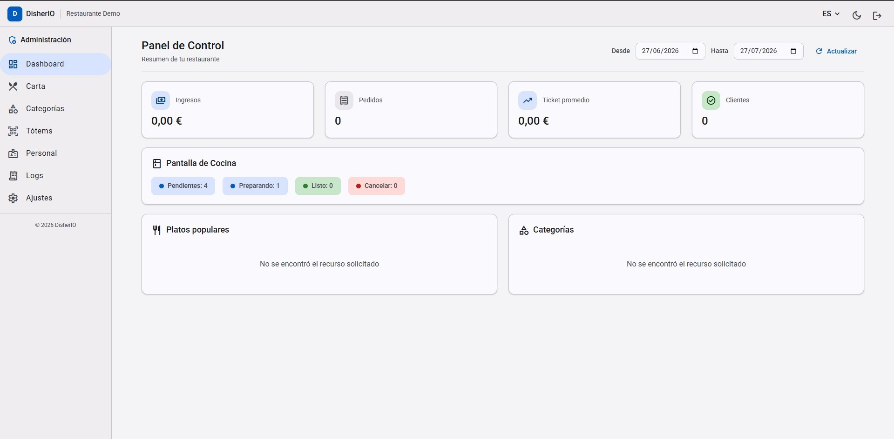

The dashboard summarizes restaurant activity for a selectable date range:

1. Pick **Desde** / **Hasta** dates and press **Actualizar** to refresh the metrics.
2. Review the KPI cards: revenue, orders, average ticket, and customers.
3. Check the **Pantalla de Cocina** summary for live kitchen pressure (pending, in preparation, ready, cancelled).
4. Switch language, theme, or sign out from the top-right header controls.

### Menu (Carta)

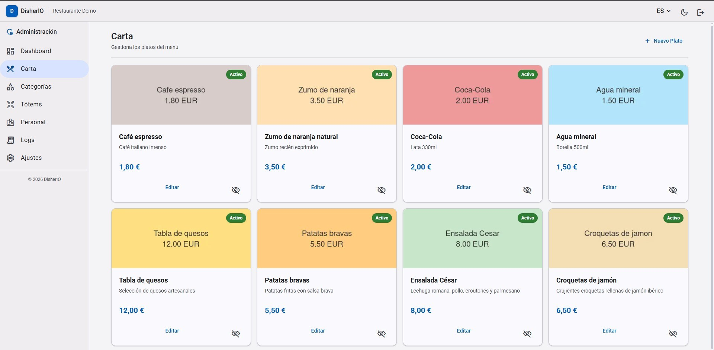

1. Press **+ Nuevo Plato** to create a dish (name per language, price, category, image).
2. Press **Editar** on a card to modify a dish.
3. Press the eye icon to toggle availability without deleting the dish — unavailable dishes disappear from the totem menu instantly.
4. The **Activo** badge shows which dishes are currently visible to customers.

### Categories

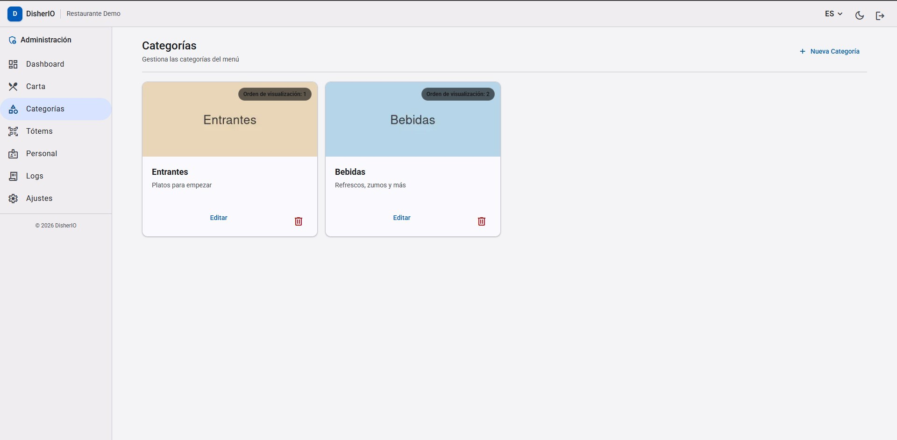

1. Press **+ Nueva Categoría** to add a menu section.
2. The **Orden de visualización** badge controls the order customers see in the totem.
3. Press **Editar** to rename or reorder; press the trash icon to delete an empty category.

### Totems and QR Codes

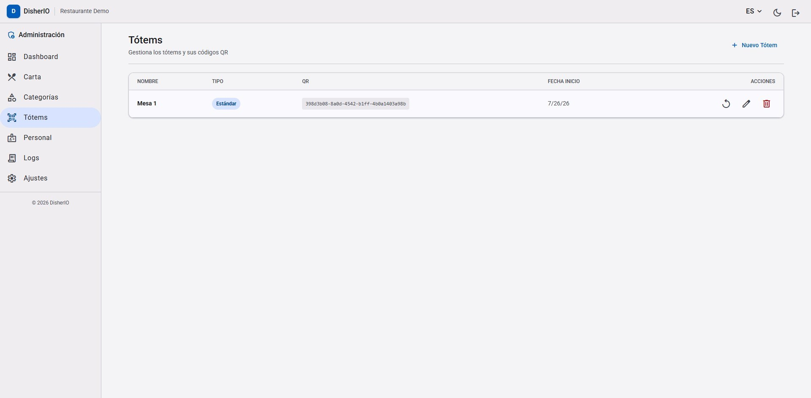

1. Press **+ Nuevo Tótem** to register a table.
2. Each totem gets a permanent QR token — print it and place it on the table.
3. Use the rotate icon to regenerate a QR (invalidates the old printed code).
4. Use the pencil to rename or the trash icon to remove a totem.

### Staff

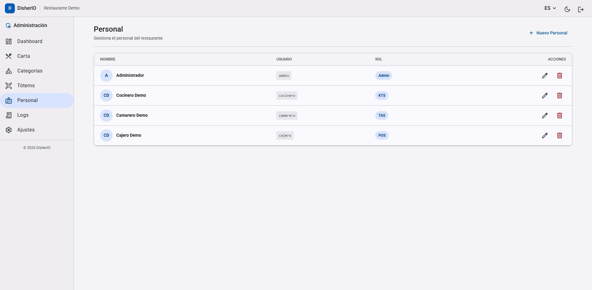

1. Press **+ Nuevo Personal** to create a staff account.
2. Assign a role per person: **Admin**, **KTS** (kitchen), **TAS** (waiter), or **POS** (cashier). Each role only sees its own module.
3. Use the pencil to edit or the trash icon to deactivate an account — active sessions for that user are revoked immediately.

### System Logs

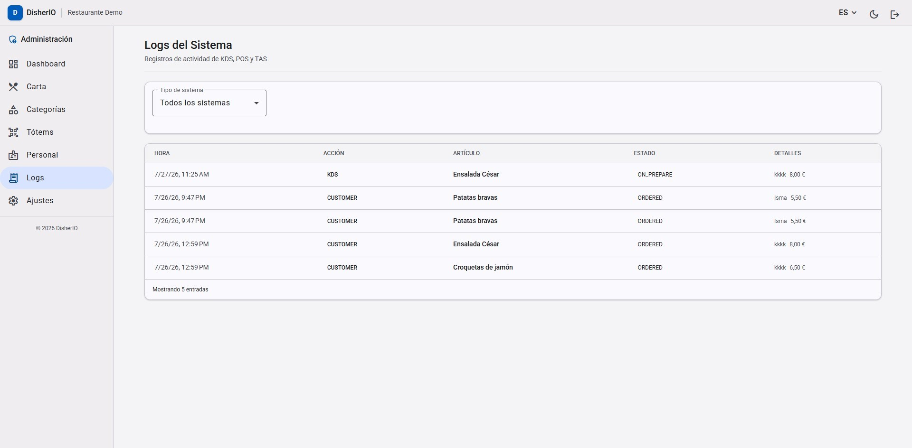

1. Filter by system with the **Tipo de sistema** dropdown (KDS, POS, TAS, customer).
2. Each row shows the time, the originating module, the item, its state, and details (who ordered and the price).

### Settings

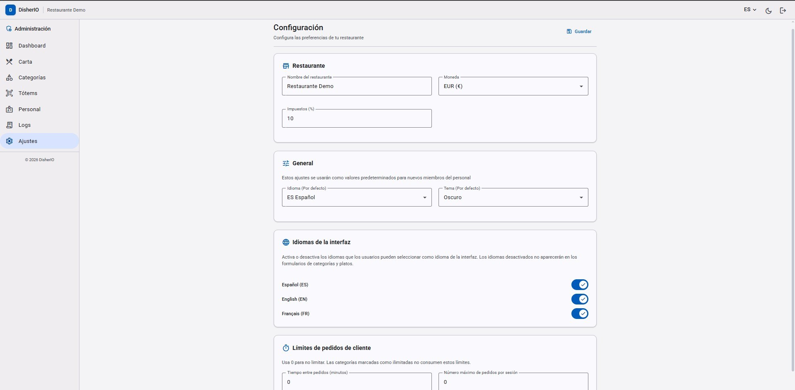

1. **Restaurante**: set the restaurant name, currency, and tax percentage, then press **Guardar**.
2. **General**: pick the default interface language and theme for new staff.
3. **Idiomas de la interfaz**: toggle which languages users can select; disabled languages disappear from dish and category forms.
4. **Límites de pedidos de cliente**: throttle customer ordering (minutes between orders, maximum orders per session). Use `0` for no limit.

---

## Kitchen Display System (KDS)

### Order Board

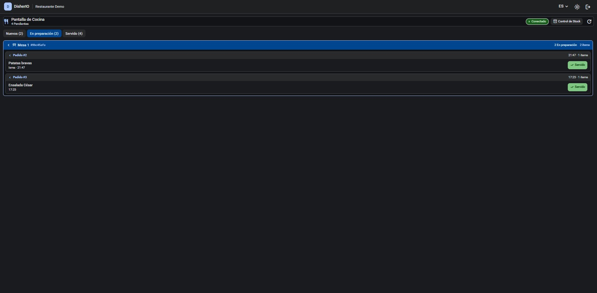

1. New orders arrive in real time under **Nuevos** — the green **Conectado** badge confirms the live connection.
2. Press an order to move it to **En preparación** when you start cooking it.
3. Press **Servido** when the dish leaves the kitchen; it moves to the **Servido** tab.
4. Orders are grouped by table with the table code and elapsed time.

### Stock Control

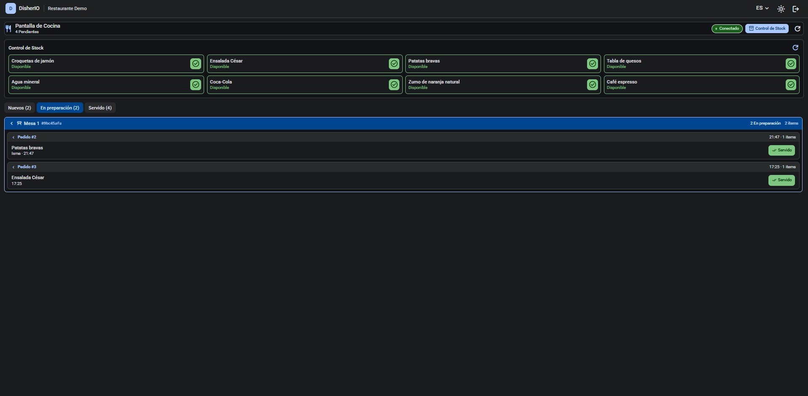

1. Press **Control de Stock** to open the availability panel.
2. Tap a dish to mark it unavailable (e.g. an ingredient ran out) — the totem menu updates instantly for every customer.
3. Tap it again to restore availability.

---

## Point of Sale (POS)

### Sessions and Tables

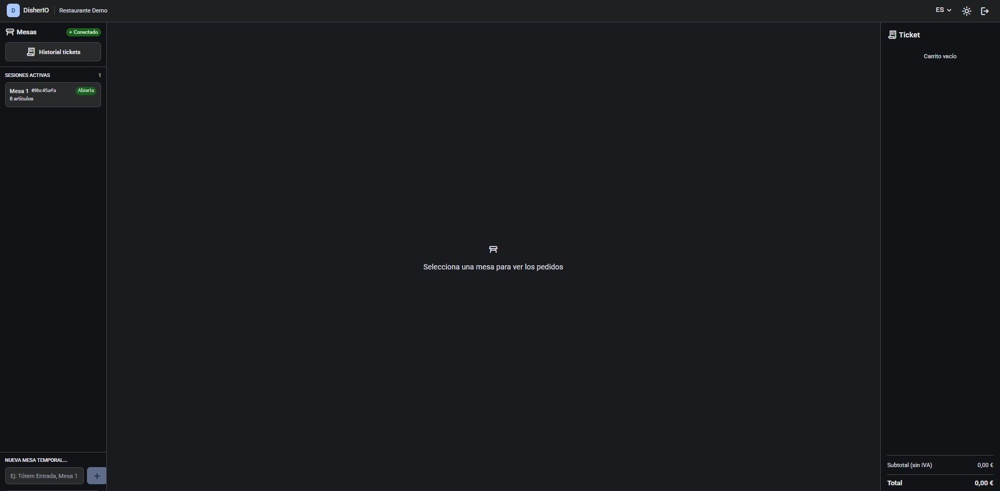

1. **Sesiones activas** lists every open table with its article count; select one to see its orders.
2. Press **Historial tickets** to browse past payments.
3. Create an ad-hoc table from **Nueva mesa temporal** (e.g. terrace or takeaway) — it works like any other totem but can be deleted later.
4. The **Ticket** panel on the right accumulates the selected items, with subtotal (tax excluded) and total.

### Charging a Table

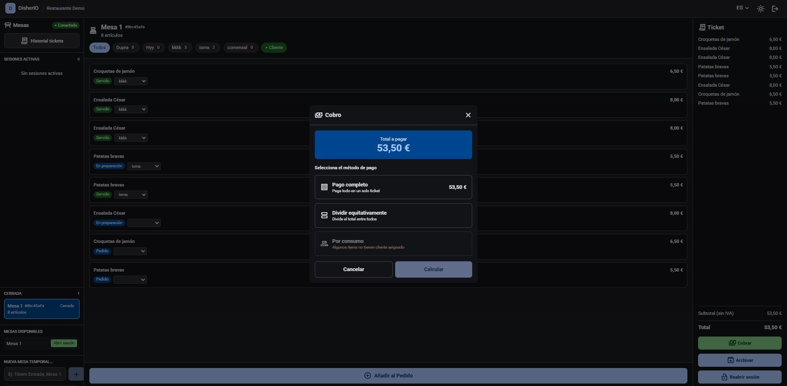

1. Select the closed session, review the item list and the **Total**, then press **Cobrar**.
2. Choose the split mode in the **Cobro** dialog:
   - **Pago completo** — a single ticket for the whole table.
   - **Dividir equitativamente** — split the total evenly between diners.
   - **Por consumo** — each diner pays only their own items (items without an assigned customer are flagged).
3. Press **Calcular** to preview the tickets, confirm the payment, and the session is archived to history.
4. **Reabrir sesión** returns a closed session to service if the table is not done; **Archivar** finalizes it.

---

## Table Assistance Service (TAS)

### Table Overview

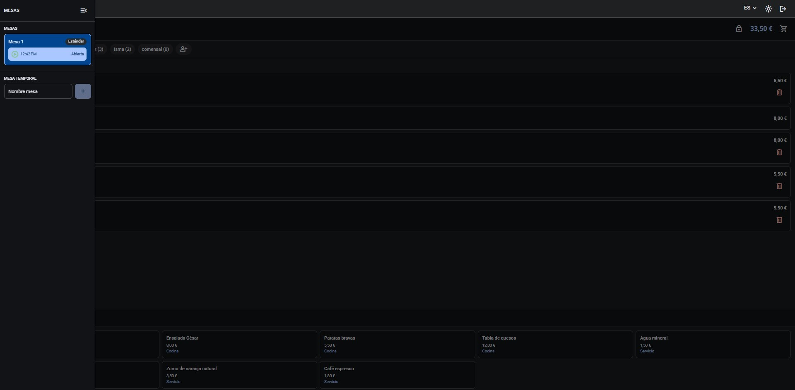

1. The **Mesas** panel lists open tables with their state; the colored dot signals activity.
2. Create a temporary table with the **Nombre mesa** field and **+**.
3. Select a table to see its live session: diners, items, and the running total (top-right).
4. Delete an item with the trash icon while it has not started preparation.

### Session Detail

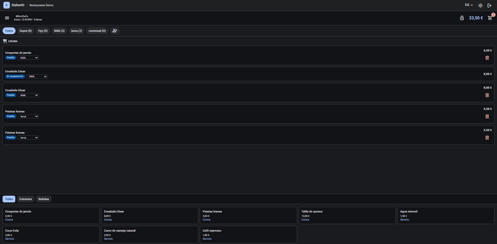

1. Filter items by diner with the chips (**Todos**, each customer name) — item counts appear next to each name.
2. Track each item's state badge: **Pedido**, **En preparación**, **Servido**.
3. Add items on behalf of a diner: pick them from the catalog at the bottom (filtered by **Entrantes** / **Bebidas** tabs) after choosing the diner chip.
4. Add a walk-in diner with the **+** chip.

### Sending an Order

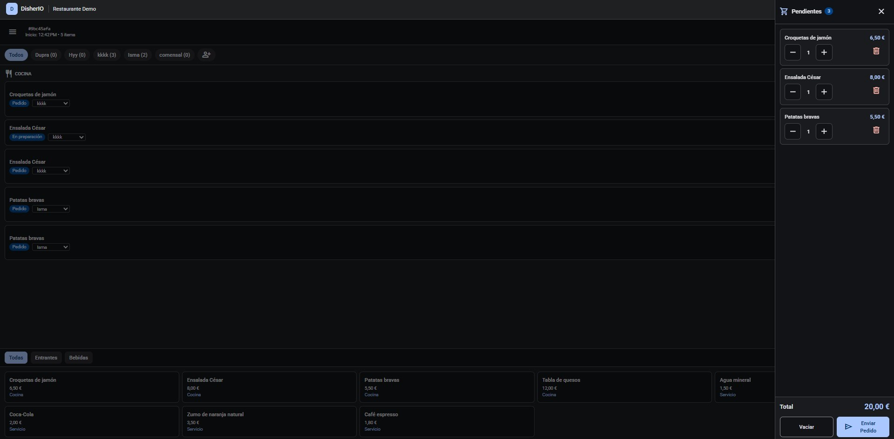

1. Added items land in the **Pendientes** cart (badge shows the count).
2. Adjust quantities with **−** / **+** or remove lines with the trash icon.
3. Press **Enviar Pedido** to fire the order to the kitchen — the KDS board updates immediately.
4. Press **Vaciar** to discard the whole cart.

---

## Customer Totem (Mobile)

### Welcome

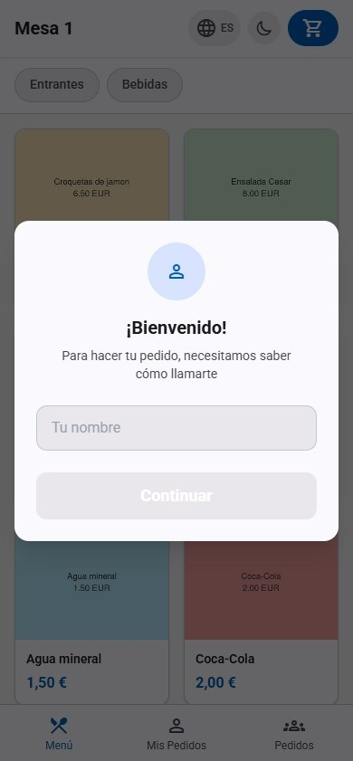

1. Scan the table QR — the menu opens directly, no login needed.
2. Type your name in **Tu nombre** and press **Continuar**; the kitchen and waiter see who ordered each dish.
3. Use the globe icon to switch language and the moon icon to toggle dark mode.

### Browsing the Menu

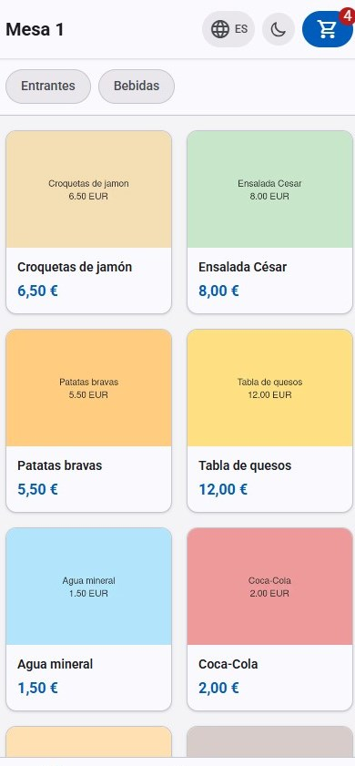

1. Switch sections with the category chips (**Entrantes**, **Bebidas**).
2. Tap a dish card to add it to your order — the cart badge counts your items.
3. The bottom bar navigates between **Menú**, **Mis Pedidos** (your placed orders), and **Pedidos** (the whole table).

### Placing the Order

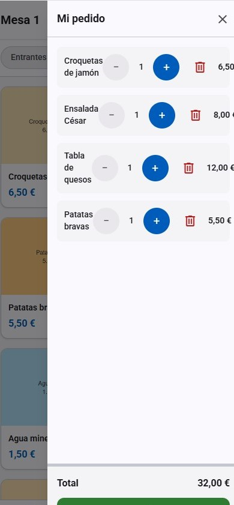

1. Tap the cart icon to open **Mi pedido**.
2. Adjust quantities with **−** / **+** or remove a line with the trash icon.
3. Check the **Total** and press **Pedir** — the order goes straight to the kitchen and appears in **Mis Pedidos** with live status updates.

---

## See Also

- [README](../README.md) — module overview and quick start
- [Architecture](ARCHITECTURE.md) — session lifecycle, real-time model, security boundaries
- [Troubleshooting](ERRORS.md) — error codes and diagnostics
