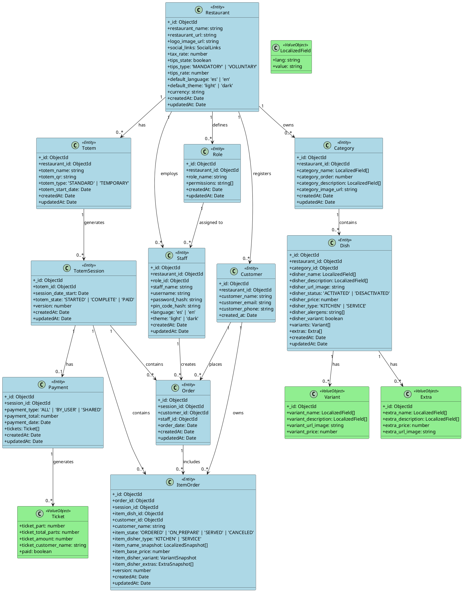

# 📐 ANÁLISIS ARQUITECTÓNICO COMPLETO - DISHERIO

> **Documento Técnico Académico**  
> **Fecha de Generación:** 2026-04-05  
> **Versión:** 1.0  
> **Autor:** Agentes de Arquitectura de Software

---

## 📋 ÍNDICE DE CONTENIDOS

1. [Arquitectura General](#1-arquitectura-general)
2. [Patrones de Diseño Utilizados](#2-patrones-de-diseño-utilizados)
3. [Flujo de Datos](#3-flujo-de-datos)
4. [Comunicación entre Componentes](#4-comunicación-entre-componentes)
5. [Diagrama de Casos de Uso](#5-diagrama-de-casos-de-uso)
6. [Diagrama de Clases](#6-diagrama-de-clases)
7. [Diagrama de Secuencia](#7-diagrama-de-secuencia)
8. [Diagrama de Estados](#8-diagrama-de-estados)
9. [Componentes del Sistema](#9-componentes-del-sistema)
10. [Flujos de Negocio](#10-flujos-de-negocio)

---

## 1. ARQUITECTURA GENERAL

### 1.1 Patrón de Arquitectura: Monolito Modular

DisherIo implementa una arquitectura de **Monolito Modular** con separación clara de responsabilidades. Aunque se despliega como una unidad, está estructurado internamente en módulos independientes que podrían evolucionar hacia microservicios.

```
┌─────────────────────────────────────────────────────────────────────────────┐
│                           DISHERIO PLATFORM                                  │
├─────────────────────────────────────────────────────────────────────────────┤
│                                                                              │
│  ┌─────────────────────┐         ┌─────────────────────┐                    │
│  │   FRONTEND LAYER    │         │    BACKEND LAYER    │                    │
│  │    (Angular 21)     │◄───────►│   (Express 5 + TS)  │                    │
│  │                     │  HTTP   │                     │                    │
│  │  ┌─────────────┐    │ WebSocket│  ┌─────────────┐   │                    │
│  │  │   Admin     │    │         │  │   API REST  │   │                    │
│  │  │   Module    │    │         │  │   Routes    │   │                    │
│  │  └─────────────┘    │         │  └─────────────┘   │                    │
│  │  ┌─────────────┐    │         │  ┌─────────────┐   │                    │
│  │  │    KDS      │    │         │  │   Socket    │   │                    │
│  │  │   Module    │    │         │  │   Handlers  │   │                    │
│  │  └─────────────┘    │         │  └─────────────┘   │                    │
│  │  ┌─────────────┐    │         │  ┌─────────────┐   │                    │
│  │  │    TAS      │    │         │  │  Services   │   │                    │
│  │  │   Module    │    │         │  └─────────────┘   │                    │
│  │  └─────────────┘    │         │  ┌─────────────┐   │                    │
│  │  ┌─────────────┐    │         │  │Repositories │   │                    │
│  │  │    POS      │    │         │  └─────────────┘   │                    │
│  │  │   Module    │    │         │  ┌─────────────┐   │                    │
│  │  └─────────────┘    │         │  │    Models   │   │                    │
│  │  ┌─────────────┐    │         │  └─────────────┘   │                    │
│  │  │   Totem     │    │         │                    │                    │
│  │  │   Module    │    │         │                    │                    │
│  │  └─────────────┘    │         │                    │                    │
│  └─────────────────────┘         └─────────────────────┘                    │
│                                                                              │
│  ┌─────────────────────────────────────────────────────────────────────┐   │
│  │                      DATA LAYER                                      │   │
│  │  ┌──────────────┐  ┌──────────────┐  ┌──────────────┐              │   │
│  │  │   MongoDB    │  │    Redis     │  │   In-Memory  │              │   │
│  │  │  (Primary)   │  │   (Cache)    │  │   (Session)  │              │   │
│  │  └──────────────┘  └──────────────┘  └──────────────┘              │   │
│  └─────────────────────────────────────────────────────────────────────┘   │
│                                                                              │
└─────────────────────────────────────────────────────────────────────────────┘
```

### 1.2 Diagrama de Componentes de Alto Nivel

```
┌──────────────────────────────────────────────────────────────────────────────┐
│                           CLIENT LAYER                                        │
├──────────────────┬──────────────────┬──────────────────┬─────────────────────┤
│   Web Browser    │   Mobile/Tablet  │   Totem Kiosk    │   Kitchen Display   │
│   (Staff Admin)  │   (Waiter TAS)   │   (Customer)     │   (KDS)             │
└────────┬─────────┴────────┬─────────┴────────┬─────────┴──────────┬──────────┘
         │                  │                  │                    │
         └──────────────────┴────────┬─────────┴────────────────────┘
                                     │ HTTPS/WSS
                                     ▼
┌──────────────────────────────────────────────────────────────────────────────┐
│                          GATEWAY LAYER                                        │
│                              (Caddy 2)                                        │
│  ┌─────────────────┐    ┌─────────────────┐    ┌─────────────────────────┐   │
│  │  Reverse Proxy  │    │  Static Assets  │    │  TLS Termination        │   │
│  │  /api/* → BE    │    │  / → Frontend   │    │  Auto HTTPS/Let's Encrypt│  │
│  └─────────────────┘    └─────────────────┘    └─────────────────────────┘   │
└──────────────────────────────────────────────────────────────────────────────┘
                                     │
                    ┌────────────────┼────────────────┐
                    │                │                │
                    ▼                ▼                ▼
         ┌─────────────────┐ ┌─────────────────┐ ┌─────────────────┐
         │   Frontend App  │ │   Backend API   │ │   WebSocket     │
         │   (Port 4200)   │ │   (Port 3000)   │ │   Server        │
         │                 │ │                 │ │   (Socket.IO)   │
         │  • Angular SPA  │ │  • Express      │ │                 │
         │  • PWA Support  │ │  • Middlewares  │ │  • Real-time    │
         │  • Lazy Loading │ │  • Controllers  │ │  • Broadcasting │
         └─────────────────┘ │  • Services     │ └─────────────────┘
                             └────────┬────────┘
                                      │
                    ┌─────────────────┼─────────────────┐
                    │                 │                 │
                    ▼                 ▼                 ▼
         ┌─────────────────┐ ┌─────────────────┐ ┌─────────────────┐
         │    MongoDB      │ │     Redis       │ │   File System   │
         │   (Port 27017)  │ │   (Port 6379)   │ │   (Uploads)     │
         │                 │ │                 │ │                 │
         │  • Orders       │ │  • Sessions     │ │  • Images       │
         │  • Users        │ │  • Cache        │ │  • Receipts     │
         │  • Dishes       │ │  • Rate Limits  │ │                 │
         │  • Restaurant   │ │  • Pub/Sub      │ │                 │
         └─────────────────┘ └─────────────────┘ └─────────────────┘
```

### 1.3 Diagrama de Despliegue

```
┌─────────────────────────────────────────────────────────────────────────────┐
│                           DOCKER HOST                                        │
│                    (Development / Production)                                │
├─────────────────────────────────────────────────────────────────────────────┤
│                                                                              │
│  ┌─────────────────────────────────────────────────────────────────────┐   │
│  │                         docker-compose network                       │   │
│  │                         (disherio_disherio_net)                      │   │
│  │                                                                      │   │
│  │   ┌─────────────┐      ┌─────────────┐      ┌─────────────┐         │   │
│  │   │   Caddy     │◄────►│   Backend   │◄────►│   MongoDB   │         │   │
│  │   │   :80/:443  │      │   :3000     │      │   :27017    │         │   │
│  │   │   :8080     │      │             │      │             │         │   │
│  │   └──────┬──────┘      └──────┬──────┘      └─────────────┘         │   │
│  │          │                    │                                     │   │
│  │          │             ┌──────┴──────┐      ┌─────────────┐         │   │
│  │          │             │    Redis    │      │   Frontend  │         │   │
│  │          │             │   :6379     │      │   :4200     │         │   │
│  │          │             │             │      │             │         │   │
│  │          │             └─────────────┘      └─────────────┘         │   │
│  │          │                                                          │   │
│  │          ▼                                                          │   │
│  │   ┌─────────────┐                                                   │   │
│  │   │   Client    │                                                   │   │
│  │   │  (External) │                                                   │   │
│  │   └─────────────┘                                                   │   │
│  │                                                                      │   │
│  └─────────────────────────────────────────────────────────────────────┘   │
│                                                                              │
│  ┌─────────────────────────────────────────────────────────────────────┐   │
│  │                     MONITORING STACK (Optional)                      │   │
│  │                                                                      │   │
│  │   ┌───────────┐  ┌───────────┐  ┌───────────┐  ┌───────────┐       │   │
│  │   │Prometheus │  │  Grafana  │  │Alertmanage│  │  Exporters │       │   │
│  │   │  :9090    │  │  :3001    │  │   :9093   │  │  (Various) │       │   │
│  │   └───────────┘  └───────────┘  └───────────┘  └───────────┘       │   │
│  │                                                                      │   │
│  └─────────────────────────────────────────────────────────────────────┘   │
│                                                                              │
└─────────────────────────────────────────────────────────────────────────────┘
```

### 1.4 Capas de la Aplicación

#### 1.4.1 Backend Layer Architecture (Clean Architecture)

```
┌─────────────────────────────────────────────────────────────────────────────┐
│                           PRESENTATION LAYER                                 │
│  ┌─────────────────────────────────────────────────────────────────────┐   │
│  │  Routes (Express Routers)                                           │   │
│  │  ├── auth.routes.ts      → /api/auth                                │   │
│  │  ├── order.routes.ts     → /api/orders                              │   │
│  │  ├── dish.routes.ts      → /api/dishes                              │   │
│  │  ├── restaurant.routes.ts→ /api/restaurant                          │   │
│  │  ├── staff.routes.ts     → /api/staff                               │   │
│  │  ├── customer.routes.ts  → /api/customers                           │   │
│  │  ├── totem.routes.ts     → /api/totems                              │   │
│  │  ├── dashboard.routes.ts → /api/dashboard                           │   │
│  │  └── menu-language.routes.ts → /api/menu-languages                  │   │
│  └─────────────────────────────────────────────────────────────────────┘   │
├─────────────────────────────────────────────────────────────────────────────┤
│                           BUSINESS LOGIC LAYER                               │
│  ┌─────────────────────────────────────────────────────────────────────┐   │
│  │  Controllers (Request/Response Handling)                            │   │
│  │  ├── auth.controller.ts    → Authentication flows                   │   │
│  │  ├── order.controller.ts   → Order CRUD operations                  │   │
│  │  ├── dish.controller.ts    → Menu management                        │   │
│  │  ├── restaurant.controller.ts → Restaurant config                   │   │
│  │  └── ...                                                            │   │
│  └─────────────────────────────────────────────────────────────────────┘   │
│                                                                              │
│  ┌─────────────────────────────────────────────────────────────────────┐   │
│  │  Services (Business Logic / Domain Rules)                           │   │
│  │  ├── auth.service.ts       → JWT, bcrypt, login/logout              │   │
│  │  ├── order.service.ts      → Order processing, state machine        │   │
│  │  ├── dish.service.ts       → Dish validation, pricing               │   │
│  │  ├── restaurant.service.ts → Multi-tenant logic                     │   │
│  │  ├── payment.service.ts    → Payment processing, tickets            │   │
│  │  ├── cache.service.ts      → Redis caching                          │   │
│  │  └── image.service.ts      → File upload, Sharp processing          │   │
│  └─────────────────────────────────────────────────────────────────────┘   │
├─────────────────────────────────────────────────────────────────────────────┤
│                           SOCKET LAYER (Real-time)                           │
│  ┌─────────────────────────────────────────────────────────────────────┐   │
│  │  Socket Handlers (Event-driven Communication)                       │   │
│  │  ├── kds.handler.ts        → Kitchen Display System events          │   │
│  │  ├── tas.handler.ts        → Table Assistance Service events        │   │
│  │  ├── pos.handler.ts        → Point of Sale events                   │   │
│  │  └── totem.handler.ts      → Customer totem events                  │   │
│  │                                                                     │   │
│  │  Middleware:                                                        │   │
│  │  ├── socketAuth.ts         → JWT validation for sockets             │   │
│  │  ├── rate-limiter.ts       → Socket rate limiting                   │   │
│  │  ├── connection-tracker.ts → Connection management                  │   │
│  │  └── session-validator.ts  → Session access validation              │   │
│  └─────────────────────────────────────────────────────────────────────┘   │
├─────────────────────────────────────────────────────────────────────────────┤
│                           DATA ACCESS LAYER                                  │
│  ┌─────────────────────────────────────────────────────────────────────┐   │
│  │  Repositories (Data Access Abstraction)                             │   │
│  │  ├── base.repository.ts    → Generic CRUD operations                │   │
│  │  ├── order.repository.ts   → Order-specific queries                 │   │
│  │  ├── dish.repository.ts    → Dish aggregations                      │   │
│  │  ├── user.repository.ts    → User lookups                           │   │
│  │  ├── totem.repository.ts   → Totem session queries                  │   │
│  │  └── ...                                                            │   │
│  └─────────────────────────────────────────────────────────────────────┘   │
├─────────────────────────────────────────────────────────────────────────────┤
│                           INFRASTRUCTURE LAYER                               │
│  ┌─────────────────────────────────────────────────────────────────────┐   │
│  │  Models (Mongoose Schemas)                                          │   │
│  │  ├── order.model.ts        → Order, ItemOrder, Payment schemas      │   │
│  │  ├── dish.model.ts         → Dish, Category schemas                 │   │
│  │  ├── restaurant.model.ts   → Restaurant, Printer schemas            │   │
│  │  ├── staff.model.ts        → Staff, Role schemas                    │   │
│  │  ├── customer.model.ts     → Customer schema                        │   │
│  │  └── totem.model.ts        → Totem, TotemSession schemas            │   │
│  └─────────────────────────────────────────────────────────────────────┘   │
│                                                                              │
│  ┌─────────────────────────────────────────────────────────────────────┐   │
│  │  External Services / Utils                                          │   │
│  │  ├── db.ts                 → MongoDB connection                     │   │
│  │  ├── socket.ts             → Socket.IO initialization               │   │
│  │  ├── i18n.ts               → Internationalization                   │   │
│  │  ├── logger.ts             → Pino logging                           │   │
│  │  ├── circuit-breaker.ts    → Fault tolerance                        │   │
│  │  └── transactions.ts       → MongoDB transactions                   │   │
│  └─────────────────────────────────────────────────────────────────────┘   │
└─────────────────────────────────────────────────────────────────────────────┘
```

#### 1.4.2 Frontend Layer Architecture

```
┌─────────────────────────────────────────────────────────────────────────────┐
│                           PRESENTATION LAYER                                 │
│  ┌─────────────────────────────────────────────────────────────────────┐   │
│  │  Feature Components (Smart Components)                              │   │
│  │  ├── kds/kds.component.ts       → Kitchen display                   │   │
│  │  ├── tas/tas.component.ts       → Waiter interface                  │   │
│  │  ├── pos/pos.component.ts       → Cashier interface                 │   │
│  │  ├── totem/totem.component.ts   → Customer ordering                 │   │
│  │  └── admin/                     → Admin dashboard                   │   │
│  │      ├── dashboard.component.ts                                     │   │
│  │      ├── dish-list.component.ts                                     │   │
│  │      ├── dish-form.component.ts                                     │   │
│  │      └── staff-*.component.ts                                       │   │
│  └─────────────────────────────────────────────────────────────────────┘   │
├─────────────────────────────────────────────────────────────────────────────┤
│                           SHARED COMPONENTS LAYER                            │
│  ┌─────────────────────────────────────────────────────────────────────┐   │
│  │  UI Components (Dumb/Presentational)                                │   │
│  │  ├── header.component.ts        → Navigation header                 │   │
│  │  ├── layout.component.ts        → Main layout shell                 │   │
│  │  ├── toast.component.ts         → Notification system               │   │
│  │  ├── localized-input.component.ts→ i18n input field                 │   │
│  │  └── image-uploader.component.ts→ File upload with preview          │   │
│  │                                                                     │   │
│  │  Directives:                                                        │   │
│  │  └── casl.directive.ts          → Permission-based visibility       │   │
│  │                                                                     │   │
│  │  Pipes:                                                             │   │
│  │  ├── localize.pipe.ts           → Translation pipe                  │   │
│  │  ├── translate.pipe.ts          → i18n pipe                         │   │
│  │  └── currency-format.pipe.ts    → Money formatting                  │   │
│  └─────────────────────────────────────────────────────────────────────┘   │
├─────────────────────────────────────────────────────────────────────────────┤
│                           STATE MANAGEMENT LAYER                             │
│  ┌─────────────────────────────────────────────────────────────────────┐   │
│  │  Angular Signals Stores (Reactive State)                            │   │
│  │  ├── auth.store.ts              → Authentication state              │   │
│  │  ├── kds.store.ts               → Kitchen orders state              │   │
│  │  ├── tas.store.ts               → Waiter session state              │   │
│  │  ├── cart.store.ts              → Shopping cart state               │   │
│  │  └── theme.store.ts             → UI theme state                    │   │
│  │                                                                     │   │
│  │  Features:                                                          │   │
│  │  • Signal-based reactivity (Angular 16+)                            │   │
│  │  • Reference counting for memory management                         │   │
│  │  • Computed signals for derived state                               │   │
│  └─────────────────────────────────────────────────────────────────────┘   │
├─────────────────────────────────────────────────────────────────────────────┤
│                           SERVICE LAYER                                      │
│  ┌─────────────────────────────────────────────────────────────────────┐   │
│  │  API Services (HTTP Communication)                                  │   │
│  │  ├── tas.service.ts             → Waiter API calls                  │   │
│  │  ├── staff.service.ts           → Staff management                  │   │
│  │  ├── restaurant.service.ts      → Restaurant config                 │   │
│  │  ├── menu-language.service.ts   → Translation management            │   │
│  │  └── totem.service.ts           → Customer-facing API               │   │
│  │                                                                     │   │
│  │  Real-time Services:                                                │   │
│  │  └── socket/socket.service.ts   → Socket.IO client                  │   │
│  │       • Connection management with reference counting                │   │
│  │       • Event buffering for offline support                          │   │
│  │       • Automatic reconnection with exponential backoff              │   │
│  │                                                                     │   │
│  │  Core Services:                                                     │   │
│  │  ├── i18n.service.ts            → Internationalization              │   │
│  │  ├── theme.service.ts           → Dark/light mode                   │   │
│  │  ├── notification.service.ts    → Toast notifications               │   │
│  │  └── error-handler.service.ts   → Global error handling             │   │
│  └─────────────────────────────────────────────────────────────────────┘   │
├─────────────────────────────────────────────────────────────────────────────┤
│                           CORE/INFRASTRUCTURE LAYER                          │
│  ┌─────────────────────────────────────────────────────────────────────┐   │
│  │  Guards (Route Protection)                                          │   │
│  │  ├── auth.guard.ts              → Login check                       │   │
│  │  └── role.guard.ts              → Permission check                  │   │
│  │                                                                     │   │
│  │  Interceptors (HTTP Pipeline)                                       │   │
│  │  ├── jwt.interceptor.ts         → Attach auth token                 │   │
│  │  └── error.interceptor.ts       → HTTP error handling               │   │
│  │                                                                     │   │
│  │  CASL (Authorization)                                               │   │
│  │  └── ability.factory.ts         → Define user abilities             │   │
│  └─────────────────────────────────────────────────────────────────────┘   │
└─────────────────────────────────────────────────────────────────────────────┘
```


---

## 2. PATRONES DE DISEÑO UTILIZADOS

### 2.1 Repository Pattern

El patrón Repository abstrae el acceso a datos, proporcionando una interfaz uniforme entre la capa de negocio y la capa de datos.

```typescript
// Base Repository - Abstracción genérica
abstract class BaseRepository<T extends Document> {
  protected model: Model<T>;
  
  async findById(id: string): Promise<T | null>
  async find(filter: SimpleFilter): Promise<T[]>
  async create(data: Partial<T>): Promise<T>
  async update(id: string, data: UpdateQuery<T>): Promise<T | null>
  async delete(id: string): Promise<T | null>
}

// Specialized Repositories
class OrderRepository extends BaseRepository<IOrder> {
  async getOrdersWithItems(sessionId: string): Promise<PopulatedOrder[]>
  async getKDSItemsWithDetails(sessionIds: string[], options: KDSQueryOptions): Promise<KDSItem[]>
  async getDailyMetrics(sessionIds: string[], date: Date): Promise<DailyMetrics>
}

class DishRepository extends BaseRepository<IDish> {
  async findByRestaurantWithCategories(restaurantId: string): Promise<CategorizedDishes>
  async searchByName(restaurantId: string, query: string): Promise<IDish[]>
}
```

**Beneficios:**
- ✅ Desacoplamiento entre lógica de negocio y persistencia
- ✅ Facilidad de testing (mocks/repositories in-memory)
- ✅ Centralización de queries complejas
- ✅ Capacidad de cambiar el motor de base de datos sin afectar servicios

### 2.2 Dependency Injection (DI)

Tanto el backend como el frontend utilizan DI extensivamente.

#### Backend (Node.js/TypeScript - Manual DI)
```typescript
// Services instancian repositories
const orderRepo = new OrderRepository();
const itemOrderRepo = new ItemOrderRepository();
const paymentRepo = new PaymentRepository();

// Las funciones del service utilizan las instancias
export async function createOrder(sessionId: string, staffId?: string) {
  return withTransaction(async (session) => {
    const totemSession = await totemSessionRepo.findById(sessionId);
    // ...
  });
}
```

#### Frontend (Angular - Native DI)
```typescript
@Injectable({ providedIn: 'root' })
export class SocketService {
  private socket: Socket | null = null;
  
  constructor() {
    // Angular inyecta automáticamente
  }
}

// Uso en componentes
export class KdsComponent {
  private socketService = inject(SocketService);
  private tasService = inject(TasService);
}
```

### 2.3 Circuit Breaker Pattern

Protección contra cascadas de fallos en operaciones críticas.

```typescript
// Circuit breaker para crear órdenes
const createOrderBreaker = new CircuitBreaker(
  async (sessionId: string, staffId?: string, customerId?: string) => {
    return withTransaction(async (session) => {
      const totemSession = await totemSessionRepo.findById(sessionId);
      if (!totemSession || totemSession.totem_state !== 'STARTED') {
        throw new Error(ErrorCode.SESSION_NOT_ACTIVE);
      }
      return orderRepo.createOrder(sessionId, staffId, customerId, session);
    });
  },
  { 
    failureThreshold: 3,      // Abrir después de 3 fallos
    resetTimeout: 15000,      // Intentar cerrar después de 15s
    halfOpenMaxCalls: 2       // Máximo 2 llamadas en estado half-open
  },
  'OrderService.createOrder'
);

// Registro en monitor
CircuitBreakerMonitor.register(createOrderBreaker);
```

**Estados del Circuit Breaker:**
```
┌─────────┐     Fallo      ┌─────────┐     Timeout     ┌─────────┐
│  CLOSED │───────────────►│  OPEN   │────────────────►│HALF-OPEN│
│  (OK)   │                │ (Fail)  │                 │ (Test)  │
└────┬────┘                └─────────┘◄────────────────┴────┬────┘
     │                                                       │
     │                      Éxito                            │
     └───────────────────────────────────────────────────────┘
```

### 2.4 State Machine Pattern

Máquina de estados para el ciclo de vida de ítems de orden.

```typescript
// KITCHEN items flow: ORDERED -> ON_PREPARE -> SERVED
// SERVICE items flow: ORDERED -> SERVED (skip ON_PREPARE)

const KITCHEN_STATE_TRANSITIONS: Record<string, string[]> = {
  ORDERED: ['ON_PREPARE', 'CANCELED'],
  ON_PREPARE: ['SERVED', 'CANCELED'],
  SERVED: [],
  CANCELED: [],
};

const SERVICE_STATE_TRANSITIONS: Record<string, string[]> = {
  ORDERED: ['SERVED', 'CANCELED'],
  SERVED: [],
  CANCELED: [],
};

function validateStateTransition(
  currentState: string, 
  newState: string, 
  itemType?: 'KITCHEN' | 'SERVICE'
): void {
  const transitions = itemType === 'SERVICE' 
    ? SERVICE_STATE_TRANSITIONS 
    : KITCHEN_STATE_TRANSITIONS;
  const validTransitions = transitions[currentState];
  if (!validTransitions?.includes(newState)) {
    throw new Error(ErrorCode.INVALID_STATE_TRANSITION);
  }
}
```

### 2.5 Observer Pattern (Event-Driven)

Implementado mediante Socket.IO para comunicación en tiempo real.

```typescript
// Backend - Event emitters
function emitItemStateChanged(sessionId: string, itemId: string, newState: string): void {
  getIO().to(`session:${sessionId}`).emit('item:state_changed', { itemId, newState });
}

function notifyKDSNewItem(sessionId: string, itemData: any): void {
  emitToKDS(sessionId, 'kds:new_item', { ...itemData, timestamp: new Date().toISOString() });
}

// Frontend - Event listeners (RxJS Subjects)
private totemItemUpdateSubject = new Subject<ItemUpdateEvent>();
public totemItemUpdate$ = this.totemItemUpdateSubject.asObservable();

// Suscripción en componentes
this.socketService.totemItemUpdate$.subscribe(update => {
  this.handleItemUpdate(update);
});
```

### 2.6 Singleton Pattern

Stores y servicios core son singletons gestionados por el framework.

```typescript
// Angular Injectable - Singleton por defecto
@Injectable({ providedIn: 'root' })
export class SocketService { }

// Store signals - Singleton manual
const _items = signal<KdsItem[]>([]);
export const kdsStore: KdsStore = {
  items: _items.asReadonly(),
  // ...
};

// Repository instances - Singleton manual
const orderRepo = new OrderRepository();
const dishRepo = new DishRepository();
```

### 2.7 Factory Pattern

Creación de abilities basadas en roles de usuario.

```typescript
// CASL Ability Factory
export function defineAbilityFor(user: JwtPayload) {
  const { can, cannot, build } = new AbilityBuilder<AppAbility>(createMongoAbility);
  
  if (user.permissions.includes('ADMIN')) {
    can('manage', 'all');
  } else if (user.permissions.includes('KTS')) {
    can('read', 'KitchenOrder');
    can('update', 'KitchenOrder', { status: 'ORDERED' });
  }
  // ...
  return build();
}
```

### 2.8 Strategy Pattern

Diferentes estrategias de cálculo de tickets de pago.

```typescript
// Estrategia: Pago completo (ALL)
function buildAllTicket(total: number): Ticket[] {
  return [{ part: 1, totalParts: 1, amount: total, paid: false }];
}

// Estrategia: Pago por usuario (BY_USER)
async function buildByUserTickets(sessionId: string): Promise<Ticket[]> {
  const items = await itemOrderRepo.findActiveBySessionId(sessionId);
  // Agrupar por cliente
  return groupItemsByCustomer(items);
}

// Estrategia: Pago dividido (SHARED)
function buildSharedTickets(total: number, parts: number): Ticket[] {
  const baseAmount = total / parts;
  return Array.from({ length: parts }, (_, i) => ({
    part: i + 1,
    totalParts: parts,
    amount: Math.round(baseAmount * 100) / 100,
    paid: false
  }));
}
```

### 2.9 Middleware Pattern (Chain of Responsibility)

Pipeline de procesamiento de requests HTTP.

```typescript
// Express Middleware Chain
app.use(securityMiddleware);      // 1. Seguridad (CORS, Helmet)
app.use(requestLogger);           // 2. Logging
app.use(express.json());          // 3. Parsing
app.use(languageMiddleware);      // 4. Detección de idioma
app.use('/api', apiLimiter);      // 5. Rate limiting
app.use(authMiddleware);          // 6. Autenticación
app.use('/api/admin', rbacMiddleware); // 7. Autorización
```

### 2.10 Optimistic Concurrency Control

Control de concurrencia optimista con versionado de documentos.

```typescript
const TotemSessionSchema = new Schema<ITotemSession>({
  totem_id: { type: Schema.Types.ObjectId, ref: 'Totem', required: true },
  totem_state: { type: String, enum: ['STARTED', 'COMPLETE', 'PAID'], default: 'STARTED' },
  version: { type: Number, default: 0 },  // ← Versión para optimistic locking
}, { 
  timestamps: true,
  optimisticConcurrency: true  // ← Habilitado
});

// Índice compuesto para locking
TotemSessionSchema.index({ _id: 1, version: 1 });
```

---

## 3. FLUJO DE DATOS

### 3.1 Request/Response Cycle (HTTP)

```
┌─────────┐     HTTP Request      ┌─────────────┐     ┌─────────────┐
│ Client  │──────────────────────►│   Caddy     │────►│   Express   │
│         │                       │   Proxy     │     │   Server    │
└─────────┘                       └─────────────┘     └──────┬──────┘
     ▲                                                       │
     │                                                       ▼
     │                                                ┌─────────────┐
     │                                                │  Middleware │
     │                                                │   Pipeline  │
     │                                                └──────┬──────┘
     │                                                       │
     │   ┌───────────────────────────────────────────────────┘
     │   │
     │   ▼                                                ┌─────────────┐
     │  ┌─────────────┐    ┌─────────────┐    ┌──────────►│  Controller │
     │  │    Error    │◄───│   Service   │◄───┤           └──────┬──────┘
     │  │   Handler   │    │   Layer     │    │                  │
     │  └──────┬──────┘    └─────────────┘    │           ┌──────▼──────┐
     │         │                               │           │  Repository │
     │         │    Response                   │           └──────┬──────┘
     │         └───────────────────────────────┘                  │
     │                                                            ▼
     │                                                     ┌─────────────┐
     └─────────────────────────────────────────────────────│   MongoDB   │
                                                           └─────────────┘
```

### 3.2 Flujo de Autenticación

```
┌─────────────────────────────────────────────────────────────────────────────┐
│                         FLUJO DE AUTENTICACIÓN                               │
├─────────────────────────────────────────────────────────────────────────────┤
│                                                                              │
│  ┌──────────┐                      ┌──────────┐         ┌──────────────┐   │
│  │  Client  │                      │ Backend  │         │   Database   │   │
│  └────┬─────┘                      └────┬─────┘         └──────┬───────┘   │
│       │                                  │                      │          │
│       │  1. POST /api/auth/login         │                      │          │
│       │     { username, password }       │                      │          │
│       ├─────────────────────────────────►│                      │          │
│       │                                  │                      │          │
│       │                                  │  2. Query user       │          │
│       │                                  ├─────────────────────►│          │
│       │                                  │                      │          │
│       │                                  │  3. User document    │          │
│       │                                  │◄─────────────────────┤          │
│       │                                  │                      │          │
│       │                                  │  4. bcrypt.compare() │          │
│       │                                  │  (password_hash)     │          │
│       │                                  │                      │          │
│       │                                  │  5. Query role       │          │
│       │                                  ├─────────────────────►│          │
│       │                                  │                      │          │
│       │                                  │  6. Role document    │          │
│       │                                  │     (permissions)    │          │
│       │                                  │◄─────────────────────┤          │
│       │                                  │                      │          │
│       │                                  │  7. JWT.sign()       │          │
│       │                                  │  { staffId,          │          │
│       │                                  │    restaurantId,     │          │
│       │                                  │    role,             │          │
│       │                                  │    permissions }     │          │
│       │                                  │                      │          │
│       │  8. HTTP 200 + Set-Cookie        │                      │          │
│       │     { token, user }              │                      │          │
│       │◄─────────────────────────────────┤                      │          │
│       │                                  │                      │          │
│       │  9. Store in localStorage        │                      │          │
│       │     (Angular Signals Store)      │                      │          │
│       │                                  │                      │          │
│       │                                  │                      │          │
│       │  ━━━━━━━━━━ SUBSECUENTES ━━━━━━━━━━                      │          │
│       │                                  │                      │          │
│       │  10. Request protegido           │                      │          │
│       │      Authorization: Bearer <jwt> │                      │          │
│       ├─────────────────────────────────►│                      │          │
│       │                                  │                      │          │
│       │                                  │  11. JWT.verify()    │          │
│       │                                  │  (middleware auth)   │          │
│       │                                  │                      │          │
│       │                                  │  12. Set req.user    │          │
│       │                                  │                      │          │
│       │  13. Response con datos          │                      │          │
│       │◄─────────────────────────────────┤                      │          │
│       │                                  │                      │          │
└───────┴──────────────────────────────────┴──────────────────────┴──────────┘
```

### 3.3 Flujo de Creación de Órdenes

```
┌─────────────────────────────────────────────────────────────────────────────┐
│                    FLUJO DE CREACIÓN DE ÓRDENES                              │
├─────────────────────────────────────────────────────────────────────────────┤
│                                                                              │
│  CLIENTE (Totem)              BACKEND                    KITCHEN (KDS)      │
│       │                          │                           │               │
│       │  1. Scan QR              │                           │               │
│       │  2. Join session         │                           │               │
│       ├─────────────────────────►│                           │               │
│       │  socket: totem:join      │                           │               │
│       │                          │                           │               │
│       │  3. Session joined       │                           │               │
│       │◄─────────────────────────┤                           │               │
│       │                          │                           │               │
│       │  4. Browse menu          │                           │               │
│       │  GET /api/dishes         │                           │               │
│       ├─────────────────────────►│                           │               │
│       │                          ├───────────────────────────┤               │
│       │                          │  Query active dishes      │               │
│       │◄─────────────────────────┤                           │               │
│       │  5. Menu data            │                           │               │
│       │                          │                           │               │
│       │  6. Add items to cart    │                           │               │
│       │  (Local state - cart.store)                          │               │
│       │                          │                           │               │
│       │  7. Place order          │                           │               │
│       ├─────────────────────────►│                           │               │
│       │  socket: totem:place_order                            │               │
│       │  { items[], sessionId }  │                           │               │
│       │                          │                           │               │
│       │                          │  8. Validate session      │               │
│       │                          │     Check totem_state     │               │
│       │                          │                           │               │
│       │                          │  9. Create Order document │               │
│       │                          │     Create ItemOrder docs │               │
│       │                          │     (with price snapshot) │               │
│       │                          │                           │               │
│       │                          │  10. Save to MongoDB      │               │
│       │                          │     (Transaction)         │               │
│       │                          │                           │               │
│       │  11. Order confirmed     │                           │               │
│       │◄─────────────────────────┤                           │               │
│       │  socket: totem:order_placed                           │               │
│       │                          │                           │               │
│       │                          │  12. Emit to KDS          │               │
│       │                          ├──────────────────────────►│               │
│       │                          │  socket: kds:new_item     │               │
│       │                          │  (if kitchen items)       │               │
│       │                          │                           │               │
│       │                          │  13. Emit to TAS          │               │
│       │                          │  socket: tas:new_customer_order            │
│       │                          │                           │               │
│       │                          │  14. Emit to POS          │               │
│       │                          │  socket: pos:new_order    │               │
│       │                          │                           │               │
└───────┴──────────────────────────┴───────────────────────────┴───────────────┘
```


### 3.4 Flujo de Notificaciones en Tiempo Real (WebSockets)

```
┌─────────────────────────────────────────────────────────────────────────────┐
│              ARQUITECTURA DE EVENTOS WEBSOCKET                               │
├─────────────────────────────────────────────────────────────────────────────┤
│                                                                              │
│                           ┌─────────────┐                                    │
│                           │ Socket.IO   │                                    │
│                           │   Server    │                                    │
│                           └──────┬──────┘                                    │
│                                  │                                           │
│              ┌───────────────────┼───────────────────┐                       │
│              │                   │                   │                       │
│              ▼                   ▼                   ▼                       │
│       ┌────────────┐      ┌────────────┐      ┌────────────┐                │
│       │   Rooms    │      │   Rooms    │      │   Rooms    │                │
│       │ (Session)  │      │ (Kitchen)  │      │   (TAS)    │                │
│       └─────┬──────┘      └─────┬──────┘      └─────┬──────┘                │
│             │                   │                   │                        │
│    ┌────────┴────────┐   ┌─────┴──────┐      ┌─────┴──────┐                │
│    │                 │   │            │      │            │                │
│    ▼                 ▼   ▼            ▼      ▼            ▼                │
│ ┌──────┐  ┌──────┐  ┌──────┐  ┌──────┐  ┌──────┐  ┌──────┐               │
│ │Client│  │Client│  │Client│  │Client│  │Client│  │Client│               │
│ │  A   │  │  B   │  │ KDS1 │  │ KDS2 │  │TAS-1 │  │TAS-2 │               │
│ └──────┘  └──────┘  └──────┘  └──────┘  └──────┘  └──────┘               │
│                                                                              │
│  EJEMPLO: Item state change ORDERED → ON_PREPARE                            │
│  ═══════════════════════════════════════════════════                        │
│                                                                              │
│  1. KDS Client (KDS1) emite:                                                │
│     socket.emit('kds:item_prepare', { itemId: 'xxx' })                      │
│                                                                              │
│  2. kds.handler.ts recibe evento                                            │
│     • Valida permisos (user.permissions.includes('KTS'))                    │
│     • Valida suscripción a sesión                                           │
│     • Actualiza MongoDB: ItemOrder.findOneAndUpdate()                       │
│       { _id: itemId, item_state: 'ORDERED' } → { item_state: 'ON_PREPARE' } │
│                                                                              │
│  3. Emite eventos a múltiples rooms:                                        │
│     • io.to(`session:${sessionId}`).emit('item:state_changed', ...)         │
│       → Notifica a todos los clientes en la sesión                          │
│                                                                              │
│     • io.to(`tas:session:${sessionId}`).emit('tas:kitchen_item_update', ...)│
│       → Notifica a meseros (TAS)                                            │
│                                                                              │
│     • io.to(`customer:session:${sessionId}`).emit('order:item_update', ...) │
│       → Notifica a clientes en el totem                                     │
│                                                                              │
│  4. Cada cliente actualiza su estado local (Angular Signals):               │
│     • KDS:  kdsStore.updateItemState(itemId, 'ON_PREPARE')                  │
│     • TAS:  tasStore.updateItemState(itemId, 'ON_PREPARE')                  │
│     • Totem: Recibe notificación de actualización                           │
│                                                                              │
└─────────────────────────────────────────────────────────────────────────────┘
```

### 3.5 Flujo de Sincronización KDS (Kitchen Display System)

```
┌─────────────────────────────────────────────────────────────────────────────┐
│                    FLUJO KDS - SINCRONIZACIÓN DE ÓRDENES                     │
├─────────────────────────────────────────────────────────────────────────────┤
│                                                                              │
│   COCINA (KDS)              SERVIDOR                   BASE DE DATOS        │
│        │                       │                            │               │
│        │  1. Conexión WebSocket│                            │               │
│        ├──────────────────────►│                            │               │
│        │   (auth con JWT)     │                            │               │
│        │                      │                            │               │
│        │  2. Unirse a sesión  │                            │               │
│        ├──────────────────────►│                            │               │
│        │   kds:join {sessionId}│                            │               │
│        │                      │                            │               │
│        │                      │  3. Validar acceso         │               │
│        │                      ├────────────────────────────►│               │
│        │                      │                            │               │
│        │                      │◄────────────────────────────┤               │
│        │                      │                            │               │
│        │  4. Confirmado       │                            │               │
│        │◄──────────────────────┤                            │               │
│        │   kds:joined         │                            │               │
│        │                      │                            │               │
│        │                      │  5. Query items activos    │               │
│        │                      ├────────────────────────────►│               │
│        │                      │  (estado: ORDERED, ON_PREPARE)            │
│        │                      │                            │               │
│        │  6. Lista inicial    │◄────────────────────────────┤               │
│        │◄──────────────────────┤                            │               │
│        │   kds:new_item (xN)  │                            │               │
│        │                      │                            │               │
│        │  ═════════════════ STATE MACHINE ═══════════════  │               │
│        │                      │                            │               │
│        │  7. Click "Preparar" │                            │               │
│        ├──────────────────────►│                            │               │
│        │   kds:item_prepare   │                            │               │
│        │                      │                            │               │
│        │                      │  8. Atomic update          │               │
│        │                      ├────────────────────────────►│               │
│        │                      │  findOneAndUpdate(         │               │
│        │                      │    { _id, state: ORDERED },│               │
│        │                      │    { $set: { state: ON_PREPARE } }         │
│        │                      │  )                         │               │
│        │                      │                            │               │
│        │                      │◄────────────────────────────┤               │
│        │                      │                            │               │
│        │  9. Confirmación     │                            │               │
│        │◄──────────────────────┤                            │               │
│        │   kds:item_prepared  │                            │               │
│        │                      │                            │               │
│        │                      │  10. Broadcast a todos     │               │
│        │                      │  • item:state_changed      │               │
│        │                      │  • tas:kitchen_item_update │               │
│        │                      │  • order:item_update       │               │
│        │                      │                            │               │
│        │  11. UI se actualiza │                            │               │
│        │  (item mueve de      │                            │               │
│        │   "Pendiente" a      │                            │               │
│        │   "En preparación")  │                            │               │
│        │                      │                            │               │
│        │  12. Click "Listo"   │                            │               │
│        ├──────────────────────►│                            │               │
│        │   kds:item_serve     │                            │               │
│        │                      │                            │               │
│        │                      │  (Repetir pasos 8-11 con   │               │
│        │                      │  estado SERVED)            │               │
│        │                      │                            │               │
└────────┴──────────────────────┴────────────────────────────┴───────────────┘
```

### 3.6 Flujo de Pago/POS (Point of Sale)

```
┌─────────────────────────────────────────────────────────────────────────────┐
│                    FLUJO DE PAGO - POS (Point of Sale)                       │
├─────────────────────────────────────────────────────────────────────────────┤
│                                                                              │
│  CAJA (POS)              SERVIDOR                  BASE DE DATOS            │
│       │                     │                           │                   │
│       │  1. Solicitar cuenta│                           │                   │
│       │────────────────────►│                           │                   │
│       │  POST /api/orders/calculate                     │                   │
│       │  { sessionId }     │                           │                   │
│       │                     │                           │                   │
│       │                     │  2. Calcular total        │                   │
│       │                     ├───────────────────────────►│                   │
│       │                     │  • Sumar items activos    │                   │
│       │                     │  • Aplicar impuestos      │                   │
│       │                     │  • Calcular propina       │                   │
│       │                     │                           │                   │
│       │  3. Detalle cuenta │◄───────────────────────────┤                   │
│       │◄────────────────────┤                           │                   │
│       │  { subtotal, tax,  │                           │                   │
│       │    tips, total }   │                           │                   │
│       │                     │                           │                   │
│       │  4. Crear pago     │                           │                   │
│       │────────────────────►│                           │                   │
│       │  POST /api/orders/payment                       │                   │
│       │  {                │                           │                   │
│       │    sessionId,    │                           │                   │
│       │    paymentType:  │                           │                   │
│       │      'ALL' |     │                           │                   │
│       │      'BY_USER' | │                           │                   │
│       │      'SHARED',   │                           │                   │
│       │    parts: N      │                           │                   │
│       │  }               │                           │                   │
│       │                     │                           │                   │
│       │                     │  5. Generar tickets       │                   │
│       │                     │                           │                   │
│       │                     │  IF paymentType === 'ALL':│                   │
│       │                     │    ticket = [total]       │                   │
│       │                     │                           │                   │
│       │                     │  IF paymentType === 'SHARED':               │
│       │                     │    tickets = split(total, parts)            │
│       │                     │                           │                   │
│       │                     │  IF paymentType === 'BY_USER':              │
│       │                     │    tickets = groupByCustomer(items)         │
│       │                     │                           │                   │
│       │                     │  6. Guardar Payment doc   │                   │
│       │                     ├───────────────────────────►│                   │
│       │                     │                           │                   │
│       │                     │  7. Update session state  │                   │
│       │                     │    'STARTED' → 'COMPLETE' │                   │
│       │                     │                           │                   │
│       │  8. Tickets creados│◄───────────────────────────┤                   │
│       │◄────────────────────┤                           │                   │
│       │  { tickets[] }     │                           │                   │
│       │                     │                           │                   │
│       │  ═════════════════ PAGO PARCIAL ══════════════ │                   │
│       │                     │                           │                   │
│       │  9. Marcar ticket pagado                       │                   │
│       │────────────────────►│                           │                   │
│       │  PATCH /api/orders/payment/:id                 │                   │
│       │  { ticketPart: 1, paid: true }                │                   │
│       │                     │                           │                   │
│       │                     │  10. Update ticket        │                   │
│       │                     ├───────────────────────────►│                   │
│       │                     │                           │                   │
│       │                     │  11. Verificar si todos   │                   │
│       │                     │      los tickets están    │                   │
│       │                     │      pagados               │                   │
│       │                     │                           │                   │
│       │  12. Confirmación  │◄───────────────────────────┤                   │
│       │◄────────────────────┤                           │                   │
│       │  + Broadcast:      │                           │                   │
│       │    pos:ticket_paid │                           │                   │
│       │                     │                           │                   │
│       │  (Si todos pagados)│                           │                   │
│       │                     │  13. Update session       │                   │
│       │                     │      'COMPLETE' → 'PAID'  │                   │
│       │                     ├───────────────────────────►│                   │
│       │                     │                           │                   │
│       │                     │  14. Broadcast:           │                   │
│       │                     │     pos:session_fully_paid│                   │
│       │                     │                           │                   │
└───────┴─────────────────────┴───────────────────────────┴───────────────────┘
```

---

## 4. COMUNICACIÓN ENTRE COMPONENTES

### 4.1 HTTP REST API

```
┌─────────────────────────────────────────────────────────────────────────────┐
│                    API REST - ENDPOINTS PRINCIPALES                          │
├─────────────────────────────────────────────────────────────────────────────┤
│                                                                              │
│  AUTENTICACIÓN                    ÓRDENES                                    │
│  ─────────────                    ───────                                    │
│  POST   /api/auth/login           GET    /api/orders/kitchen                 │
│  POST   /api/auth/logout          GET    /api/orders/service                 │
│  POST   /api/auth/refresh         GET    /api/orders/session/:id             │
│                                    POST  /api/orders                         │
│  USUARIOS                         POST  /api/orders/:id/items                │
│  ────────                         PATCH  /api/orders/items/:id/state         │
│  GET    /api/staff                POST  /api/orders/payment                  │
│  POST   /api/staff                PATCH  /api/orders/payment/:id             │
│  PATCH  /api/staff/:id            DELETE /api/orders/items/:id               │
│  DELETE /api/staff/:id                                                       │
│                                                                              │
│  PLATOS                           RESTAURANTE                                │
│  ─────                            ──────────                                 │
│  GET    /api/dishes               GET    /api/restaurant                     │
│  POST   /api/dishes               PATCH  /api/restaurant                     │
│  PATCH  /api/dishes/:id           GET    /api/restaurant/stats               │
│  DELETE /api/dishes/:id                                                      │
│                                                                              │
│  CLIENTES                         TÓTEMS                                     │
│  ───────                          ──────                                     │
│  GET    /api/customers            GET    /api/totems                         │
│  POST   /api/customers            POST   /api/totems                         │
│  PATCH  /api/customers/:id        PATCH  /api/totems/:id                     │
│  DELETE /api/customers/:id        DELETE /api/totems/:id                     │
│                                   POST   /api/totems/:id/session             │
│  IDIOMAS                          GET    /api/totems/validate/:qr            │
│  ───────                                                                     │
│  GET    /api/menu-languages       DASHBOARD                                  │
│  POST   /api/menu-languages       ─────────                                  │
│  PATCH  /api/menu-languages/:id   GET    /api/dashboard/metrics              │
│                                   GET    /api/dashboard/revenue              │
│  UPLOADS                          GET    /api/dashboard/popular              │
│  ───────                                                                     │
│  POST   /api/uploads              HEALTH                                     │
│  GET    /api/uploads/:filename    ──────                                     │
│                                   GET    /health                             │
│                                   GET    /health/db                          │
│                                   GET    /health/redis                       │
│                                   GET    /metrics                            │
│                                                                              │
└─────────────────────────────────────────────────────────────────────────────┘
```

### 4.2 WebSockets (Socket.IO) - Event Map

```
┌─────────────────────────────────────────────────────────────────────────────┐
│                    SOCKET.IO - MAPA DE EVENTOS                               │
├─────────────────────────────────────────────────────────────────────────────┤
│                                                                              │
│  KDS (Kitchen Display System)                                                │
│  ═══════════════════════════                                                 │
│  Client → Server:                                                            │
│    • kds:join { sessionId }              → Unirse a sesión de cocina        │
│    • kds:leave { sessionId }             → Salir de sesión                   │
│    • kds:item_prepare { itemId }         → Marcar item en preparación       │
│    • kds:item_serve { itemId }           → Marcar item como servido         │
│    • kds:item_cancel { itemId, reason }  → Cancelar item                     │
│                                                                              │
│  Server → Client:                                                            │
│    • kds:joined { sessionId }            → Confirmación de unión            │
│    • kds:new_item { item }               → Nuevo item de cocina             │
│    • kds:item_canceled { itemId }        → Item cancelado                   │
│    • kds:error { message }               → Error                             │
│                                                                              │
│  TAS (Table Assistance Service)                                              │
│  ══════════════════════════════                                              │
│  Client → Server:                                                            │
│    • tas:join { sessionId }              → Unirse a sesión de mesero        │
│    • tas:leave { sessionId }             → Salir de sesión                   │
│    • tas:add_item { orderData }          → Agregar item a orden             │
│    • tas:serve_service_item { itemId }   → Servir item de bar               │
│    • tas:cancel_item { itemId, reason }  → Cancelar item                     │
│    • tas:request_bill { sessionId, ... } → Solicitar cuenta                 │
│    • tas:call_waiter_response { ... }    → Responder llamada cliente        │
│    • tas:notify_customers { ... }        → Notificar a clientes             │
│                                                                              │
│  Server → Client:                                                            │
│    • tas:joined { sessionId }            → Confirmación                     │
│    • tas:new_customer_order { item }     → Nuevo pedido desde totem         │
│    • tas:help_requested { ... }          → Cliente solicita ayuda           │
│    • tas:bill_requested { ... }          → Se solicitó cuenta               │
│    • tas:kitchen_item_update { ... }     → Actualización de cocina          │
│                                                                              │
│  TOTEM (Customer Interface)                                                  │
│  ══════════════════════════                                                  │
│  Client → Server:                                                            │
│    • totem:join_session { sessionId, customerName }                         │
│    • totem:leave_session                                                   │
│    • totem:place_order { sessionId, items[] }                              │
│    • totem:call_waiter { sessionId, message }                              │
│    • totem:request_bill { sessionId, splitType }                           │
│    • totem:subscribe_items { sessionId }                                   │
│                                                                              │
│  Server → Client:                                                            │
│    • totem:session_joined { sessionId, otherCustomers... }                  │
│    • totem:customer_joined_table { ... }                                   │
│    • totem:order_placed { success, itemCount }                             │
│    • order:item_update { itemId, newState }                                │
│    • notification:from_waiter { message, type }                            │
│    • totem:session_closed { reason }                                       │
│    • totem:force_disconnect { reason }                                     │
│                                                                              │
│  POS (Point of Sale)                                                         │
│  ═══════════════════                                                         │
│  Client → Server:                                                            │
│    • pos:join { sessionId }                                                │
│    • pos:leave { sessionId }                                               │
│                                                                              │
│  Server → Client:                                                            │
│    • pos:bill_requested { ... }                                            │
│    • pos:session_paid { ... }                                              │
│    • pos:session_fully_paid { ... }                                        │
│    • pos:ticket_paid { ticketPart, amount }                                │
│    • kds:new_item { item }                                                 │
│                                                                              │
│  EVENTOS GLOBALES (Room: session:{id})                                       │
│  ═════════════════════════════════════                                       │
│    • item:state_changed { itemId, newState }                               │
│    • item:deleted { itemId }                                               │
│    • item:added { item, addedBy }                                          │
│    • session:paid                                                          │
│    • session:fully_paid                                                    │
│                                                                              │
└─────────────────────────────────────────────────────────────────────────────┘
```

### 4.3 Eventos Internos (Arquitectura Pub/Sub)

```
┌─────────────────────────────────────────────────────────────────────────────┐
│                    EVENTOS INTERNOS - FLUJO DE NOTIFICACIONES                │
├─────────────────────────────────────────────────────────────────────────────┤
│                                                                              │
│   Cuando ocurre un cambio en el sistema, múltiples handlers reaccionan:     │
│                                                                              │
│   ┌─────────────────┐                                                        │
│   │  Event Trigger  │                                                        │
│   │  (Service Layer)│                                                        │
│   └────────┬────────┘                                                        │
│            │                                                                 │
│            ▼                                                                 │
│   ┌─────────────────┐                                                        │
│   │  Socket Emitters│                                                        │
│   └────────┬────────┘                                                        │
│            │                                                                 │
│     ┌──────┼──────┬──────┬──────┐                                           │
│     ▼      ▼      ▼      ▼      ▼                                           │
│  ┌────┐ ┌────┐ ┌────┐ ┌────┐ ┌────┐                                        │
│  │KDS │ │TAS │ │POS │ │TOTEM│ │LOG │                                        │
│  └────┘ └────┘ └────┘ └────┘ └────┘                                        │
│                                                                              │
│   EJEMPLO: Nuevo item de cocina agregado                                    │
│   ────────────────────────────────────────                                  │
│                                                                              │
│   order.service.ts:addItemToOrder()                                         │
│           │                                                                 │
│           ├──► if (dish.disher_type === 'KITCHEN')                          │
│           │         emitNewKitchenItem(sessionId, item)                    │
│           │              └──► kds.handler.ts:notifyKDSNewItem()            │
│           │                        └──► io.to(`kitchen:session:${id}`)      │
│           │                                                                 │
│           ├──► notifyTASNewOrder(sessionId, { item, addedBy })             │
│           │              └──► tas.handler.ts:emitToTAS()                   │
│           │                        └──► io.to(`tas:session:${id}`)          │
│           │                                                                 │
│           └──► notifyPOSNewOrder(sessionId, { items, orderId })            │
│                      └──► pos.handler.ts                                     │
│                            └──► io.to(`pos:session:${id}`)                  │
│                                                                              │
└─────────────────────────────────────────────────────────────────────────────┘
```

### 4.4 Comunicación Frontend-Backend

```
┌─────────────────────────────────────────────────────────────────────────────┐
│                    COMUNICACIÓN FRONTEND-BACKEND                             │
├─────────────────────────────────────────────────────────────────────────────┤
│                                                                              │
│   ANGULAR APP                           BACKEND API                         │
│   ───────────                           ───────────                         │
│                                                                              │
│   ┌─────────────┐                       ┌─────────────┐                     │
│   │  Component  │◄─────────────────────►│  HTTP Client│                     │
│   └──────┬──────┘   HTTP Response       │  (Angular)  │                     │
│          │                              └──────┬──────┘                     │
│          │ HTTP Request                        │                            │
│          ▼                                     │                            │
│   ┌─────────────┐                       ┌──────▼──────┐                     │
│   │   Service   │                       │   Axios/    │                     │
│   │  (TasService)│◄────────────────────►│   Fetch     │                     │
│   └──────┬──────┘                       └──────┬──────┘                     │
│          │                                     │                            │
│          │                              ┌──────▼──────┐                     │
│          │                              │  Caddy      │                     │
│          │                              │  Proxy      │                     │
│          │                              └──────┬──────┘                     │
│          │                                     │                            │
│          │                              ┌──────▼──────┐                     │
│          │                              │  Express    │                     │
│          └─────────────────────────────►│  Router     │                     │
│                                         └─────────────┘                     │
│                                                                              │
│   WEBSOCKET (Socket.IO Client/Server)                                       │
│   ───────────────────────────────────                                       │
│                                                                              │
│   ┌─────────────┐                       ┌─────────────┐                     │
│   │  Component  │◄─────────────────────►│  SocketService│                   │
│   │  (KdsComponent)│  Observable        │  (Angular)   │                    │
│   └──────┬──────┘                       └──────┬──────┘                     │
│          │                                      │                            │
│          │                               ┌──────▼──────┐                     │
│          │                               │  Socket.IO  │                     │
│          │                               │   Client    │                     │
│          │                               └──────┬──────┘                     │
│          │                                      │                            │
│          │                               ┌──────▼──────┐                     │
│          │                               │  WebSocket  │                     │
│          │                               │  Connection │                     │
│          │                               └──────┬──────┘                     │
│          │                                      │                            │
│          │                               ┌──────▼──────┐                     │
│          │                               │  Socket.IO  │                     │
│          │                               │   Server    │                     │
│          └──────────────────────────────►│  (Node.js)  │                     │
│                                          └─────────────┘                     │
│                                                                              │
│   INTERCEPTORES (Pipeline HTTP)                                             │
│   ─────────────────────────────                                             │
│                                                                              │
│   Request Flow:                                                             │
│   1. Component calls Service method                                         │
│   2. JWT Interceptor adds Authorization header                              │
│   3. Error Interceptor handles 401/403/500 responses                        │
│   4. HTTP Client sends request                                              │
│                                                                              │
│   Response Flow:                                                            │
│   1. Backend returns JSON response                                          │
│   2. HTTP Client receives response                                          │
│   3. Error Interceptor processes errors                                     │
│   4. Service maps response to TypeScript types                              │
│   5. Component updates Signals store                                        │
│   6. UI automatically updates (Angular Signals)                             │
│                                                                              │
└─────────────────────────────────────────────────────────────────────────────┘
```


---

## 5. DIAGRAMA DE CASOS DE USO

### 5.1 Actores del Sistema

```
┌─────────────────────────────────────────────────────────────────────────────┐
│                            ACTORES DEL SISTEMA                               │
├─────────────────────────────────────────────────────────────────────────────┤
│                                                                              │
│   ┌──────────────┐    ┌──────────────┐    ┌──────────────┐                  │
│   │              │    │              │    │              │                  │
│   │   👤 ADMIN   │    │   👨‍🍳 KTS    │    │   🍽️ TAS    │                  │
│   │              │    │  (Kitchen    │    │  (Table      │                  │
│   │  Gestión     │    │   Staff)     │    │  Service)    │                  │
│   │  completa    │    │              │    │              │                  │
│   │  del sistema │    │  • Ver KDS   │    │  • Atender   │                  │
│   │              │    │  • Preparar  │    │    mesas     │                  │
│   │  Permisos:   │    │    platos    │    │  • Tomar     │                  │
│   │  ['ADMIN']   │    │  • Marcar    │    │    pedidos   │                  │
│   │              │    │    listos    │    │  • Servir    │                  │
│   │              │    │              │    │    bebidas   │                  │
│   │              │    │  Permisos:   │    │  • Gestionar │                  │
│   │              │    │  ['KTS']     │    │    cuentas   │                  │
│   │              │    │              │    │              │                  │
│   │              │    │              │    │  Permisos:   │                  │
│   │              │    │              │    │  ['TAS']     │                  │
│   └──────────────┘    └──────────────┘    └──────────────┘                  │
│                                                                              │
│   ┌──────────────┐    ┌──────────────┐    ┌──────────────┐                  │
│   │              │    │              │    │              │                  │
│   │   💰 POS    │    │   👤 Customer│    │   📱 System  │                  │
│   │              │    │              │    │              │                  │
│   │  Caja/       │    │  Cliente     │    │  Sistema     │                  │
│   │  Cobros      │    │  final       │    │  automático  │                  │
│   │              │    │              │    │              │                  │
│   │  • Cobrar    │    │  • Escanear  │    │  • Cron jobs │                  │
│   │    cuentas   │    │    QR        │    │  • Cleanup   │                  │
│   │  • Dividir   │    │  • Ver menú  │    │  • Backups   │                  │
│   │    pagos     │    │  • Ordenar   │    │  • Health    │                  │
│   │  • Generar   │    │  • Llamar    │    │    checks    │                  │
│   │    tickets   │    │    mesero    │    │              │                  │
│   │  • Cierres   │    │  • Pagar     │    │              │                  │
│   │              │    │              │    │              │                  │
│   │  Permisos:   │    │  Acceso:     │    │              │                  │
│   │  ['POS']     │    │  Por QR      │    │              │                  │
│   └──────────────┘    └──────────────┘    └──────────────┘                  │
│                                                                              │
└─────────────────────────────────────────────────────────────────────────────┘
```

### 5.2 Casos de Uso - Nivel Sistema

```
┌─────────────────────────────────────────────────────────────────────────────┐
│                    DIAGRAMA DE CASOS DE USO - NIVEL SISTEMA                  │
├─────────────────────────────────────────────────────────────────────────────┤
│                                                                              │
│                              ┌─────────┐                                     │
│                              │ Sistema │                                     │
│                              │ DisherIo│                                     │
│                              └────┬────┘                                     │
│                                   │                                          │
│    ┌──────────┐    ┌─────────────┼─────────────┐    ┌──────────┐            │
│    │          │    │             │             │    │          │            │
│    │  👤     ├───►│  ┌──────────┴──────────┐  │◄───┤     👤  │            │
│    │  Admin  │    │  │   GESTIÓN DE MENÚ   │  │    │  Cliente│            │
│    │         │◄───┤  │  • Crear categorías │  │    │         │            │
│    │         │    │  │  • Crear/editar     │  │    │         │            │
│    │         │    │  │    platos           │  │    │         │            │
│    │         │    │  │  • Gestionar        │  │    │         │            │
│    │         │    │  │    variantes/extras │  │    │         │            │
│    │         │    │  │  • Subir imágenes   │  │    │         │            │
│    │         │    │  └─────────────────────┘  │    │         │            │
│    │         │    │                           │    │         │            │
│    │         │◄───┤  ┌─────────────────────┐  ├───►│         │            │
│    │         │    │  │  GESTIÓN DE PEDIDOS │  │    │         │            │
│    │         │    │  │  • Crear orden      │◄─┘    │         │            │
│    │         │    │  │  • Agregar items    │       │         │            │
│    │         │    │  │  • Actualizar estado│◄──────┤         │            │
│    │         │    │  │  • Cancelar items   │       │         │            │
│    │         │    │  │  • Dividir pagos    │       │         │            │
│    │         │    │  └─────────────────────┘       │         │            │
│    │         │    │                                │         │            │
│    │         │◄───┤  ┌─────────────────────┐  ◄───┤         │            │
│    │         │    │  │  GESTIÓN DE PERSONAL│      │         │            │
│    │         │    │  │  • Crear roles      │      │         │            │
│    │         │    │  │  • Crear staff      │      │         │            │
│    │         │    │  │  • Asignar permisos │      │         │            │
│    │         │    │  │  • Gestionar acceso │      │         │            │
│    │         │    │  └─────────────────────┘      │         │            │
│    │         │    │                                │         │            │
│    │         │◄───┤  ┌─────────────────────┐       │         │            │
│    │         │    │  │  REPORTES Y ANÁLISIS│       │         │            │
│    │         │    │  │  • Ver métricas     │       │         │            │
│    │         │    │  │  • Reportes de      │       │         │            │
│    │         │    │  │    ventas           │       │         │            │
│    │         │    │  │  • Platos populares │       │         │            │
│    │         │    │  │  • Exportar datos   │       │         │            │
│    │         │    │  └─────────────────────┘       │         │            │
│    └─────────┘    │                                └─────────┘            │
│                   │                                                        │
│    ┌──────────┐   │  ┌─────────────────────┐    ┌──────────┐             │
│    │  👨‍🍳    ├───┤  │  PROCESO DE COCINA  │◄───┤    💰   │             │
│    │  KTS    │◄──┤  │  • Ver items KDS    │    │   POS   │             │
│    │         │   │  │  • Preparar platos  │    │         │             │
│    │         │   │  │  • Marcar listos    │    │         │             │
│    │         │   │  │  • Cancelar items   │◄───┤         │             │
│    │         │   │  └─────────────────────┘    │         │             │
│    │         │   │                             │         │             │
│    │         │◄──┤  ┌─────────────────────┐    │         │             │
│    │         │   │  │  SERVICIO EN SALA   │◄───┤         │             │
│    └─────────┘   │  │  (TAS)              │    │         │             │
│                  │  │  • Ver mesas        │    │         │             │
│    ┌──────────┐  │  │  • Atender llamadas │    │         │             │
│    │   🍽️    │◄─┘  │  • Tomar pedidos    │    │         │             │
│    │   TAS   │◄────┤  • Servir bebidas   │    │         │             │
│    │         │     │  • Gestionar cuentas│◄───┘         │             │
│    │         │     │  • Cobrar mesa      │              │             │
│    │         │     │  • Cerrar sesión    │              │             │
│    └─────────┘     └─────────────────────┘              └──────────┘    │
│                                                                              │
└─────────────────────────────────────────────────────────────────────────────┘
```

### 5.3 Relaciones Include/Extend

```
┌─────────────────────────────────────────────────────────────────────────────┐
│                    RELACIONES INCLUDE Y EXTEND                               │
├─────────────────────────────────────────────────────────────────────────────┤
│                                                                              │
│   INCLUDE (Inclusión obligatoria)                                           │
│   ───────────────────────────────                                           │
│                                                                              │
│   ┌─────────────────────┐                                                   │
│   │  Realizar Pedido    │                                                   │
│   │  <<abstract>>       │                                                   │
│   └──────────┬──────────┘                                                   │
│              │ <<include>>                                                  │
│      ┌───────┴───────┐                                                      │
│      ▼               ▼                                                      │
│   ┌────────┐    ┌────────┐                                                  │
│   │Validar │    │Guardar │                                                  │
│   │Sesión  │    │Items   │                                                  │
│   │Activa  │    │en DB   │                                                  │
│   └────────┘    └────────┘                                                  │
│                                                                              │
│   EXTEND (Extensión condicional)                                            │
│   ──────────────────────────────                                            │
│                                                                              │
│   ┌─────────────────────┐                                                   │
│   │  Procesar Pago      │                                                   │
│   │  <<base>>           │                                                   │
│   └──────────┬──────────┘                                                   │
│              │                                                               │
│      ┌───────┼───────┐                                                      │
│      ▼       ▼       ▼                                                      │
│   ┌────────┐ │  ┌────────┐    Condición: splitType                          │
│   │Pago    │ │  │Pago    │    ──────────────────────                         │
│   │Total   │ │  │Dividido│    • 'ALL' → Pago Total                           │
│   │<<extend│ │  │<<extend│    • 'SHARED' → Pago Dividido                     │
│   │>>      │ │  │>>      │    • 'BY_USER' → Pago por Usuario                 │
│   └────────┘ │  └────────┘                                                   │
│              │                                                               │
│           ┌────────┐                                                          │
│           │Pago    │                                                          │
│           │por     │                                                          │
│           │Usuario │                                                          │
│           │<<extend│                                                          │
│           │>>      │                                                          │
│           └────────┘                                                          │
│                                                                              │
│   GENERALIZACIÓN (Herencia de actores)                                      │
│   ─────────────────────────────────────                                     │
│                                                                              │
│                    ┌─────────┐                                              │
│                    │  Staff  │                                              │
│                    │(abstract│                                              │
│                    │  actor) │                                              │
│                    └────┬────┘                                              │
│           ┌─────────────┼─────────────┐                                     │
│           │             │             │                                     │
│           ▼             ▼             ▼                                     │
│      ┌────────┐    ┌────────┐    ┌────────┐                                │
│      │  KTS   │    │  TAS   │    │  POS   │                                │
│      │(es un) │    │(es un) │    │(es un) │                                │
│      │ Staff  │    │ Staff  │    │ Staff  │                                │
│      └────────┘    └────────┘    └────────┘                                │
│                                                                              │
└─────────────────────────────────────────────────────────────────────────────┘
```

### 5.4 Diagrama Detallado de Casos de Uso - Módulo TAS

```
┌─────────────────────────────────────────────────────────────────────────────┐
│              CASOS DE USO DETALLADOS - TAS (Table Assistance)                │
├─────────────────────────────────────────────────────────────────────────────┤
│                                                                              │
│                            ┌─────────┐                                       │
│                            │   🍽️   │                                       │
│                            │  TAS   │                                       │
│                            └────┬────┘                                       │
│                                 │                                            │
│        ┌────────────────────────┼────────────────────────┐                   │
│        │                        │                        │                   │
│        ▼                        ▼                        ▼                   │
│   ┌─────────┐             ┌─────────┐             ┌─────────┐               │
│   │ UC-001  │             │ UC-002  │             │ UC-003  │               │
│   │ Iniciar │             │Ver Lista│             │ Selec-  │               │
│   │ Sesión  │             │ de      │             │cionar   │               │
│   │ TAS     │             │ Mesas   │             │ Mesa    │               │
│   └────┬────┘             └────┬────┘             └────┬────┘               │
│        │                       │                       │                     │
│        │ <<include>>           │ <<include>>           │ <<include>>        │
│        ▼                       ▼                       ▼                     │
│   ┌─────────┐             ┌─────────┐             ┌─────────┐               │
│   │Autenticar│            │Conectar │             │Unirse a │               │
│   │ con WS  │             │Socket   │             │Room     │               │
│   └─────────┘             └─────────┘             └─────────┘               │
│                                                        │                     │
│        ┌────────────────────────┬──────────────────────┘                     │
│        │                        │                        │                   │
│        ▼                        ▼                        ▼                   │
│   ┌─────────┐             ┌─────────┐             ┌─────────┐               │
│   │ UC-004  │             │ UC-005  │             │ UC-006  │               │
│   │ Agregar │             │ Servir  │             │ Cancelar│               │
│   │ Item    │             │ Bebida  │             │ Item    │               │
│   │ a Orden │             │         │             │         │               │
│   └────┬────┘             └────┬────┘             └────┬────┘               │
│        │                       │                       │                     │
│        │ <<extend>>            │ <<extend>>            │ <<extend>>         │
│        ▼                       ▼                       ▼                     │
│   ┌─────────┐             ┌─────────┐             ┌─────────┐               │
│   │Validar  │             │Validar  │             │Requiere │               │
│   │Stock    │             │Estado   │             │Autoriz. │               │
│   │         │             │ORDERED  │             │POS/ADMIN│               │
│   └─────────┘             └─────────┘             └─────────┘               │
│                                                                              │
│        ┌────────────────────────┬────────────────────────┐                   │
│        │                        │                        │                   │
│        ▼                        ▼                        ▼                   │
│   ┌─────────┐             ┌─────────┐             ┌─────────┐               │
│   │ UC-007  │             │ UC-008  │             │ UC-009  │               │
│   │ Solicitar│            │ Cobrar  │             │ Llamar  │               │
│   │ Cuenta  │             │ Mesa    │             │ Atención│               │
│   │         │             │         │             │         │               │
│   └────┬────┘             └────┬────┘             └────┬────┘               │
│        │                       │                       │                     │
│        │ <<include>>           │ <<include>>           │                     │
│        ▼                       ▼                       │                     │
│   ┌─────────┐             ┌─────────┐                  │                     │
│   │Cerrar   │             │Generar  │                  │                     │
│   │Sesión   │             │Tickets  │                  │                     │
│   │Clientes │             │Pago     │                  │                     │
│   └─────────┘             └─────────┘                  │                     │
│                                │                       │                     │
│                                │ <<extend>>            │                     │
│                          ┌─────┴─────┐                 │                     │
│                          ▼           ▼                 │                     │
│                    ┌─────────┐  ┌─────────┐            │                     │
│                    │Pago Total│  │Pago     │            │                     │
│                    │         │  │Dividido │            │                     │
│                    └─────────┘  └─────────┘            │                     │
│                                                                              │
└─────────────────────────────────────────────────────────────────────────────┘
```

---

## 6. DIAGRAMA DE CLASES

### 6.1 Modelos de Datos Backend (Simplified UML)



### 6.2 Clases del Backend - Arquitectura de Servicios

```plantuml
@startuml Backend Service Architecture

skinparam classAttributeIconSize 0

' ============== REPOSITORIES ==============
abstract class BaseRepository<T> {
    # model: Model<T>
    + findById(id: string): Promise<T>
    + find(filter: Filter): Promise<T[]>
    + create(data: Partial<T>): Promise<T>
    + update(id: string, data: UpdateQuery<T>): Promise<T>
    + delete(id: string): Promise<T>
    + exists(filter: Filter): boolean
}

class OrderRepository {
    + createOrder(sessionId, staffId, customerId): Promise<Order>
    + getOrdersWithItems(sessionId): Promise<PopulatedOrder[]>
    + getKDSItemsWithDetails(sessionIds, options): Promise<KDSItem[]>
    + getDailyMetrics(sessionIds, date): Promise<DailyMetrics>
}

class ItemOrderRepository {
    + createItem(data): Promise<ItemOrder>
    + findBySessionId(sessionId): Promise<ItemOrder[]>
    + findActiveBySessionId(sessionId): Promise<ItemOrder[]>
    + updateState(id, state): Promise<ItemOrder>
    + assignItemToCustomer(id, customerId): Promise<ItemOrder>
}

class DishRepository {
    + findByRestaurantWithCategories(restaurantId): Promise<CategorizedDishes>
    + searchByName(restaurantId, query): Promise<Dish[]>
    + findActiveByCategory(categoryId): Promise<Dish[]>
}

class TotemSessionRepository {
    + findByTotemId(totemId): Promise<TotemSession[]>
    + findActiveByTotemId(totemId): Promise<TotemSession>
    + updateState(id, state): Promise<TotemSession>
}

BaseRepository <|-- OrderRepository
BaseRepository <|-- ItemOrderRepository
BaseRepository <|-- DishRepository
BaseRepository <|-- TotemSessionRepository

' ============== SERVICES ==============
class OrderService {
    + createOrder(sessionId, staffId, customerId): Promise<Order>
    + addItemToOrder(orderId, sessionId, dishId, variantId, extras): Promise<ItemOrder>
    + updateItemState(itemId, newState, requesterPerms): Promise<ItemOrder>
    + calculateSessionTotal(sessionId, customTip): Promise<Totals>
    + createPayment(sessionId, paymentType, parts): Promise<Payment>
    + markTicketPaid(paymentId, ticketPart): Promise<Payment>
    + getKitchenItems(restaurantId): Promise<KDSItem[]>
    + getServiceItems(restaurantId): Promise<ServiceItem[]>
}

class AuthService {
    + loginWithUsername(username, password, restaurantId): Promise<AuthResult>
    + loginWithPin(pin, restaurantId, username, ip): Promise<AuthResult>
    + hashPassword(password): Promise<string>
    + hashPin(pin): Promise<string>
}

class CacheService {
    - client: Redis
    + connect(): Promise<void>
    + get(key): Promise<any>
    + set(key, value, ttl): Promise<void>
    + delete(key): Promise<void>
    + clear(): Promise<void>
}

class ImageService {
    + processImage(file): Promise<Buffer>
    + generateThumbnail(file): Promise<Buffer>
    + save(file): Promise<string>
    + delete(filename): Promise<void>
}

' ============== SOCKET HANDLERS ==============
class KdsHandler {
    + registerHandlers(io, socket): void
    + emitToKDS(sessionId, event, data): void
    + notifyKDSNewItem(sessionId, itemData): void
}

class TasHandler {
    + registerHandlers(io, socket): void
    + emitToTAS(sessionId, event, data): void
    + notifyTASNewOrder(sessionId, orderData): void
    + notifyTASHelpRequest(sessionId, customerData): void
}

class TotemHandler {
    + registerHandlers(io, socket): void
    + emitToCustomers(sessionId, event, data): void
    + notifyCustomerItemUpdate(sessionId, itemId, state): void
    + closeSessionForCustomers(sessionId, data): void
}

class PosHandler {
    + registerHandlers(io, socket): void
    + emitSessionClosed(sessionId, closedBy): void
    + emitSessionPaid(sessionId, paymentData): void
    + emitTicketPaid(sessionId, ticketData): void
}

' ============== UTILITIES ==============
class CircuitBreaker {
    - failureCount: number
    - state: 'CLOSED' | 'OPEN' | 'HALF_OPEN'
    + execute(fn): Promise<any>
    - recordSuccess(): void
    - recordFailure(): void
}

class TransactionManager {
    + withTransaction(fn): Promise<any>
}

' ============== RELATIONSHIPS ==============
OrderService ..> OrderRepository : uses
OrderService ..> ItemOrderRepository : uses
OrderService ..> TotemSessionRepository : uses
OrderService ..> DishRepository : uses
OrderService ..> CircuitBreaker : uses

KdsHandler ..> OrderService : uses
TasHandler ..> OrderService : uses
TotemHandler ..> OrderService : uses

@enduml
```



### 6.3 Clases del Frontend - Arquitectura Angular

```plantuml
@startuml Frontend Angular Architecture

skinparam classAttributeIconSize 0

' ============== STORES (Signals) ==============
class AuthStore {
    + user: Signal<AuthUser>
    + isAuthenticated: Signal<boolean>
    + hasPermission(perm): Signal<boolean>
    + setAuth(user, expiresAt): void
    + clearAuth(): void
    + updatePreferences(prefs): void
}

class KdsStore {
    + items: Signal<KdsItem[]>
    + ordered: Signal<KdsItem[]>
    + onPrepare: Signal<KdsItem[]>
    + served: Signal<KdsItem[]>
    + setItems(items): void
    + addItem(item): void
    + updateItemState(id, state): void
    + removeItem(id): void
}

class TasStore {
    + sessions: Signal<TotemSession[]>
    + selectedSession: Signal<TotemSession>
    + sessionItems: Signal<ItemOrder[]>
    + customers: Signal<Customer[]>
    + activeSessions: Signal<TotemSession[]>
    + sessionTotal: Signal<number>
    + selectSession(session): void
    + addItem(item): void
    + updateItemState(id, state): void
}

' ============== SERVICES ==============
class SocketService {
    - socket: Socket
    - connectionRefCount: number
    + acquireConnection(): void
    + releaseConnection(): void
    + joinKdsSession(sessionId): void
    + kdsItemPrepare(itemId): void
    + kdsItemServe(itemId): void
    + joinTasSession(sessionId): void
    + tasAddItem(data): void
    + tasServeServiceItem(itemId): void
    + joinTotemSession(sessionId, name): void
    + totemPlaceOrder(orderId, items): void
}

class TasService {
    + getActiveSessions(): Observable<TotemSession[]>
    + getSessionItems(sessionId): Observable<ItemOrder[]>
    + createSession(totemId): Observable<TotemSession>
    + closeSession(sessionId): Observable<void>
    + getCustomers(): Observable<Customer[]>
    + getDishes(): Observable<Dish[]>
}

class RestaurantService {
    + getRestaurant(): Observable<Restaurant>
    + updateSettings(settings): Observable<Restaurant>
    + getStats(): Observable<Stats>
}

' ============== COMPONENTS ==============
class KdsComponent {
    - socketService: SocketService
    - kdsStore: KdsStore
    + ngOnInit(): void
    + ngOnDestroy(): void
    + onItemPrepare(item): void
    + onItemServe(item): void
    + onItemCancel(item): void
}

class TasComponent {
    - socketService: SocketService
    - tasService: TasService
    - tasStore: TasStore
    + ngOnInit(): void
    + ngOnDestroy(): void
    + selectSession(session): void
    + addItemToOrder(item): void
    + serveItem(item): void
    + requestBill(): void
}

class TotemComponent {
    - socketService: SocketService
    - totemService: TotemService
    - cartStore: CartStore
    + ngOnInit(): void
    + joinSession(): void
    + addToCart(dish): void
    + placeOrder(): void
    + callWaiter(): void
    + requestBill(): void
}

class DishFormComponent {
    - restaurantService: RestaurantService
    + saveDish(): void
    + uploadImage(file): void
}

' ============== GUARDS ==============
class AuthGuard {
    + canActivate(): boolean | UrlTree
}

class RoleGuard {
    + canActivate(route): boolean | UrlTree
}

' ============== INTERCEPTORS ==============
class JwtInterceptor {
    + intercept(req, next): Observable<HttpEvent>
}

class ErrorInterceptor {
    + intercept(req, next): Observable<HttpEvent>
}

' ============== RELATIONSHIPS ==============
KdsComponent ..> SocketService : injects
KdsComponent ..> KdsStore : uses

TasComponent ..> SocketService : injects
TasComponent ..> TasService : injects
TasComponent ..> TasStore : uses

TotemComponent ..> SocketService : injects
TotemComponent ..> CartStore : uses

SocketService ..> AuthStore : uses

AuthGuard ..> AuthStore : uses
RoleGuard ..> AuthStore : uses

JwtInterceptor ..> AuthStore : uses

@enduml
```




---

## 7. DIAGRAMA DE SECUENCIA

### 7.1 Secuencia: Login (Autenticación)

```
┌─────────────────────────────────────────────────────────────────────────────┐
│              DIAGRAMA DE SECUENCIA - LOGIN (AUTENTICACIÓN)                   │
├─────────────────────────────────────────────────────────────────────────────┤
│                                                                              │
│  Client         LoginComponent    AuthService    AuthController  AuthService  DB
│    │                  │                │               │             │       │
│    │ 1. Ingresa credenciales          │               │             │       │
│    │─────────────────►│                │               │             │       │
│    │                  │                │               │             │       │
│    │ 2. submitLogin() │                │               │             │       │
│    │                  │─────3. login()────────────────►│             │       │
│    │                  │                │               │             │       │
│    │                  │                │               │────4. loginWithUsername()
│    │                  │                │               │────────────►│       │
│    │                  │                │               │             │       │
│    │                  │                │               │             │5. findByUsername()
│    │                  │                │               │             │──────►│
│    │                  │                │               │             │       │
│    │                  │                │               │             │6. User
│    │                  │                │               │             │◄──────│
│    │                  │                │               │             │       │
│    │                  │                │               │             │7. bcrypt.compare()
│    │                  │                │               │             │       │
│    │                  │                │               │◄────────────│       │
│    │                  │                │               │8. Valid     │       │
│    │                  │                │               │             │       │
│    │                  │                │               │9. findById(role_id)
│    │                  │                │               │────────────►│       │
│    │                  │                │               │             │       │
│    │                  │                │               │10. Role     │◄──────│
│    │                  │                │               │             │       │
│    │                  │                │               │11. JWT.sign()
│    │                  │                │               │{staffId, role, perms}
│    │                  │                │               │             │       │
│    │                  │◄───────────────│───────────────│12. {token, user}
│    │                  │                │               │             │       │
│    │                  │13. authStore.setAuth()         │             │       │
│    │                  │────►localStorage               │             │       │
│    │                  │                │               │             │       │
│    │◄─────────────────│14. Router.navigate('/admin')  │             │       │
│    │                  │                │               │             │       │
│    │15. Dashboard     │                │               │             │       │
│    │◄─────────────────│                │               │             │       │
│    │                  │                │               │             │       │
└────┴──────────────────┴────────────────┴───────────────┴─────────────┴───────┘
```

### 7.2 Secuencia: Crear Orden (Desde Totem)

```
┌─────────────────────────────────────────────────────────────────────────────┐
│              DIAGRAMA DE SECUENCIA - CREAR ORDEN (TOTEM)                     │
├─────────────────────────────────────────────────────────────────────────────┤
│                                                                              │
│ Client  TotemComponent SocketService  TotemHandler  OrderService  Repositories
│   │           │              │              │             │            │
│   │ 1. Selecciona platos    │              │             │            │
│   │──────────►│              │              │             │            │
│   │           │              │              │             │            │
│   │ 2. Click "Ordenar"      │              │             │            │
│   │──────────►│              │              │             │            │
│   │           │              │              │             │            │
│   │           │3. totemPlaceOrder()         │             │            │
│   │           │─────────────►│              │             │            │
│   │           │              │              │             │            │
│   │           │              │4. Emit 'totem:place_order' │            │
│   │           │              │─────────────►│             │            │
│   │           │              │              │             │            │
│   │           │              │              │5. Validate session       │
│   │           │              │              │────────────────────────►│
│   │           │              │              │             │            │
│   │           │              │              │6. Session OK│            │
│   │           │              │              │◄────────────────────────│
│   │           │              │              │             │            │
│   │           │              │              │7. Process items          │
│   │           │              │              │             │            │
│   │           │              │              │8. addItemToOrder()       │
│   │           │              │              │────────────►│            │
│   │           │              │              │             │            │
│   │           │              │              │             │9. Validate prices
│   │           │              │              │             │            │
│   │           │              │              │             │10. Create ItemOrder
│   │           │              │              │             │────────────────►
│   │           │              │              │             │            │
│   │           │              │              │             │11. Saved   │
│   │           │              │              │             │◄───────────────│
│   │           │              │              │             │            │
│   │           │              │              │12. notifyKDSNewItem()    │
│   │           │              │              │ (if kitchen)│            │
│   │           │              │              │             │            │
│   │           │              │              │13. notifyTASNewOrder()   │
│   │           │              │              │             │            │
│   │           │              │              │14. notifyPOSNewOrder()   │
│   │           │              │              │             │            │
│   │           │              │15. Emit confirmations    │             │
│   │           │              │◄─────────────│             │            │
│   │           │              │              │             │            │
│   │           │◄─────────────│16. Observable emits     │             │
│   │           │              │              │             │            │
│   │◄──────────│17. Show success message  │              │             │
│   │           │              │              │             │            │
│   │18. Actualiza UI con items              │             │            │
│   │◄──────────│              │              │             │            │
│   │           │              │              │             │            │
└───┴───────────┴──────────────┴──────────────┴─────────────┴────────────┘
```

### 7.3 Secuencia: Actualizar Orden KDS

```
┌─────────────────────────────────────────────────────────────────────────────┐
│              DIAGRAMA DE SECUENCIA - ACTUALIZAR ORDEN KDS                    │
├─────────────────────────────────────────────────────────────────────────────┤
│                                                                              │
│ KDS-Display  KdsComponent  SocketService  KdsHandler  ItemOrder  OtherClients
│     │            │              │              │         │           │
│     │ 1. Chef ve item pendiente │              │         │           │
│     │───────────►│              │              │         │           │
│     │            │              │              │         │           │
│     │ 2. Click "Preparar"       │              │         │           │
│     │───────────►│              │              │         │           │
│     │            │              │              │         │           │
│     │            │3. kdsItemPrepare(itemId)   │         │           │
│     │            │─────────────►│              │         │           │
│     │            │              │              │         │           │
│     │            │              │4. Emit 'kds:item_prepare'           │
│     │            │              │─────────────►│         │           │
│     │            │              │              │         │           │
│     │            │              │              │5. Validate permissions
│     │            │              │              │         │           │
│     │            │              │              │6. Validate session membership
│     │            │              │              │         │           │
│     │            │              │              │7. Atomic update      │
│     │            │              │              │────────►│           │
│     │            │              │              │         │           │
│     │            │              │              │         │8. findOneAndUpdate
│     │            │              │              │         │(_id, state: ORDERED)
│     │            │              │              │         │→ {state: ON_PREPARE}
│     │            │              │              │         │           │
│     │            │              │              │◄────────│9. Updated │
│     │            │              │              │         │           │
│     │            │              │10. Broadcast events    │           │
│     │            │              │◄─────────────│         │           │
│     │            │              │              │         │           │
│     │            │              │              │11. io.to(`session:${id}`)
│     │            │              │              │    .emit('item:state_changed')
│     │            │◄─────────────│              │         │           │
│     │            │              │              │         │           │
│     │            │              │              │12. io.to(`tas:session:${id}`)
│     │            │              │              │    .emit('tas:kitchen_item_update')
│     │            │              │              │         │           │
│     │            │              │              │         │           │13. io.to(`customer:session:${id}`)
│     │            │              │              │         │           │    .emit('order:item_update')
│     │            │              │              │         │           │
│     │◄───────────│14. UI update (item moves) │         │           │
│     │            │              │              │         │           │
│     │            │15. kdsStore.updateItemState()        │           │
│     │            │────►Ordered→On Prepare column        │           │
│     │            │              │              │         │           │
│     │            │              │              │         │  TAS Client│
│     │            │              │              │         │◄──────────│
│     │            │              │              │         │16. UI shows
│     │            │              │              │         │    "Preparando..."
│     │            │              │              │         │           │
│     │            │              │              │         │  Customer  │
│     │            │              │              │         │◄──────────│
│     │            │              │              │         │17. Notification
│     │            │              │              │         │    "Tu pedido se
│     │            │              │              │         │     está preparando"
│     │            │              │              │         │           │
└─────┴────────────┴──────────────┴──────────────┴─────────┴───────────┘
```

### 7.4 Secuencia: Notificación Tiempo Real

```
┌─────────────────────────────────────────────────────────────────────────────┐
│              DIAGRAMA DE SECUENCIA - NOTIFICACIÓN TIEMPO REAL                │
├─────────────────────────────────────────────────────────────────────────────┤
│                                                                              │
│  ┌─────────────────────────────────────────────────────────────────────┐   │
│  │                         ESCENARIO: Cliente solicita ayuda            │   │
│  └─────────────────────────────────────────────────────────────────────┘   │
│                                                                              │
│  CustomerPhone  TotemComponent  SocketService  TotemHandler  TAS-Devices  DB
│       │              │              │              │            │         │
│       │ 1. Click "Llamar mesero"   │              │            │         │
│       │─────────────►│              │              │            │         │
│       │              │              │              │            │         │
│       │              │2. totemCallWaiter()        │            │         │
│       │              │─────────────►│              │            │         │
│       │              │              │              │            │         │
│       │              │              │3. Emit 'totem:call_waiter'          │
│       │              │              │─────────────►│            │         │
│       │              │              │              │            │         │
│       │              │              │              │4. Validate customer in session
│       │              │              │              │            │         │
│       │              │              │              │5. Get session info     │
│       │              │              │              │────────────┤         │
│       │              │              │              │            │         │
│       │              │              │              │◄───────────│         │
│       │              │              │              │            │         │
│       │              │              │              │6. notifyTASHelpRequest()
│       │              │              │              │            │         │
│       │              │              │              │7. emitToTAS(sessionId, ...)
│       │              │              │              │            │         │
│       │              │              │              │8. io.to(`tas:session:${id}`)
│       │              │              │              │    .emit('tas:help_requested')
│       │              │              │              │            │         │
│       │              │              │              │            │         │
│       │              │              │              │   TAS-1    │   TAS-2 │
│       │              │              │              │◄───────────┤         │
│       │              │              │              │            │◄────────│
│       │              │              │              │            │         │
│       │              │              │              │9. Play sound + vibration
│       │              │              │              │   Show notification banner
│       │              │              │              │   "Mesa 5 necesita ayuda"
│       │              │              │              │            │         │
│       │              │◄─────────────│              │10. Emit confirmation    │
│       │              │              │              │            │         │
│       │◄─────────────│11. Show "Mesero en camino" │            │         │
│       │              │              │              │            │         │
│       │              │              │              │            │         │
│       │              │              │              │12. TAS acknowledges     │
│       │              │              │              │◄───────────┤         │
│       │              │              │              │            │         │
│       │              │              │              │13. emitToCustomers()
│       │              │              │              │   'waiter:acknowledged'
│       │              │              │              │            │         │
│       │◄─────────────│              │              │14. "Juan va a atenderte"
│       │              │              │              │            │         │
└───────┴──────────────┴──────────────┴──────────────┴────────────┴─────────┘
```

---

## 8. DIAGRAMA DE ESTADOS

### 8.1 Estados de Order (ItemOrder)

```
┌─────────────────────────────────────────────────────────────────────────────┐
│                    DIAGRAMA DE ESTADOS - ITEMORDER                           │
├─────────────────────────────────────────────────────────────────────────────┤
│                                                                              │
│   KITCHEN ITEMS (Platos de cocina)                                          │
│   ═════════════════════════════════                                         │
│                                                                              │
│                        ┌─────────┐                                          │
│         ┌─────────────►│ ORDERED │◄────────────────┐                        │
│         │              │ (Nuevo) │                 │                        │
│         │              └────┬────┘                 │                        │
│         │                   │                       │                        │
│         │   Cancel          │   Start Prepare      │   Add Item              │
│         │   (Admin/POS)     │   (Kitchen Staff)    │   (Customer/Waiter)     │
│         │                   │                       │                        │
│         │                   ▼                       │                        │
│         │            ┌─────────────┐                │                        │
│         │            │  ON_PREPARE │                │                        │
│         │            │ (Cocinando) │                │                        │
│         │            └──────┬──────┘                │                        │
│         │                   │                       │                        │
│         │   Force Cancel    │   Finish             │                        │
│         │   (Admin/POS)     │   (Kitchen Staff)    │                        │
│         │                   │                       │                        │
│         │                   ▼                       │                        │
│         │            ┌─────────────┐                │                        │
│         └───────────►│   SERVED    │                │                        │
│                      │  (Listo)    │                │                        │
│                      └─────────────┘                │                        │
│                            │                        │                        │
│                            │   Delete              │                        │
│                            │   (Terminal)          │                        │
│                            ▼                        │                        │
│                      ┌─────────────┐                │                        │
│                      │   DELETED   │                │                        │
│                      │  (Archived) │                │                        │
│                      └─────────────┘                │                        │
│                                                                              │
│                                                                              │
│   SERVICE ITEMS (Bebidas, entrantes fríos)                                  │
│   ═════════════════════════════════════════                                 │
│                                                                              │
│                        ┌─────────┐                                          │
│         ┌─────────────►│ ORDERED │◄────────────────┐                        │
│         │              │ (Nuevo) │                 │                        │
│         │              └────┬────┘                 │                        │
│         │                   │                       │                        │
│         │   Cancel          │   Serve              │   Add Item              │
│         │   (TAS/POS)       │   (TAS Only)         │   (No KDS)              │
│         │                   │                       │                        │
│         │                   ▼                       │                        │
│         │            ┌─────────────┐                │                        │
│         └───────────►│   SERVED    │────────────────┘                        │
│                      │  (Entregado)│                                         │
│                      └─────────────┘                                         │
│                                                                              │
│   TRANSICIONES PROHIBIDAS (Security)                                        │
│   ═══════════════════════════════════                                       │
│   • ORDERED → SERVED (Kitchen items must go through ON_PREPARE)             │
│   • ON_PREPARE → ORDERED (No rollback allowed)                              │
│   • SERVED → * (Final state - no changes)                                   │
│   • CANCELED → * (Final state - no changes)                                 │
│   • ON_PREPARE → CANCELED (Requires ADMIN/POS permission)                   │
│                                                                              │
└─────────────────────────────────────────────────────────────────────────────┘
```

### 8.2 Estados de Dish (Plato)

```
┌─────────────────────────────────────────────────────────────────────────────┐
│                    DIAGRAMA DE ESTADOS - DISH (PLATO)                        │
├─────────────────────────────────────────────────────────────────────────────┤
│                                                                              │
│                         ┌─────────────┐                                      │
│                         │   CREATED   │                                      │
│                         │  (Initial)  │                                      │
│                         └──────┬──────┘                                      │
│                                │                                             │
│                                │ Admin activates                             │
│                                ▼                                             │
│   ┌───────────────────┐   ┌─────────────┐   ┌───────────────────┐           │
│   │                   │   │  ACTIVATED  │   │                   │           │
│   │   Admin edits     │◄──│  (Visible   │──►│   Admin disables  │           │
│   │   (price, desc)   │   │   in menu)  │   │   (out of stock)  │           │
│   │                   │   └──────┬──────┘   │                   │           │
│   └───────────────────┘          │          └───────────────────┘           │
│                                  │                      │                    │
│                                  │ Admin reactivates    │                    │
│                                  │                      │                    │
│                                  ▼                      ▼                    │
│                         ┌─────────────────────────────────┐                 │
│                         │        DESACTIVATED             │                 │
│                         │      (Not visible in menu)      │                 │
│                         └─────────────────────────────────┘                 │
│                                                                              │
│   NOTAS:                                                                     │
│   • Solo platos ACTIVATED aparecen en el menú del totem                     │
│   • Los platos DESACTIVATED mantienen su historial de ventas                │
│   • Al cambiar precio, los items existentes mantienen precio snapshot       │
│                                                                              │
└─────────────────────────────────────────────────────────────────────────────┘
```

### 8.3 Estados de TotemSession (Sesión de Mesa)

```
┌─────────────────────────────────────────────────────────────────────────────┐
│                    DIAGRAMA DE ESTADOS - TOTEMSESSION                        │
├─────────────────────────────────────────────────────────────────────────────┤
│                                                                              │
│                              ┌─────────┐                                     │
│                              │  IDLE   │                                     │
│                              │ (Empty) │                                     │
│                              └────┬────┘                                     │
│                                   │                                          │
│                                   │ Customer scans QR / Waiter opens session │
│                                   ▼                                          │
│   ┌──────────────────────────┐  ┌─────────┐  ┌──────────────────────────┐   │
│   │                          │  │ STARTED │  │                          │   │
│   │  Customer or Waiter      │  │ (Active │  │  Bill requested          │   │
│   │  requests bill           │◄─┤  - Can  │──►  (awaiting payment)     │   │
│   │                          │  │  order) │  │                          │   │
│   └──────────────────────────┘  └────┬────┘  └──────────────────────────┘   │
│                                      │                                       │
│                                      │ All tickets paid                       │
│                                      │                                        │
│                                      ▼                                        │
│                               ┌─────────────┐                                 │
│                               │   PAID      │                                 │
│                               │ (Complete)  │                                 │
│                               └──────┬──────┘                                 │
│                                      │                                        │
│                                      │ Auto-archive after 24h                 │
│                                      ▼                                        │
│                               ┌─────────────┐                                 │
│                               │  ARCHIVED   │                                 │
│                               │  (History)  │                                 │
│                               └─────────────┘                                 │
│                                                                              │
│   TRANSICIONES ESPECIALES:                                                   │
│   ═════════════════════════                                                  │
│                                                                              │
│   STARTED ──[Waiter cancels bill]──► STARTED                                 │
│   (Reopen session for more orders)                                           │
│                                                                              │
│   COMPLETE ──[Payment cancelled]──► STARTED                                  │
│   (Return to ordering if payment fails)                                      │
│                                                                              │
│   ESTADOS INTERNOS (Para transiciones):                                      │
│   • CLOSING - Transición intermedia cuando se solicita cuenta               │
│   • PAYMENT_PENDING - Esperando confirmación de pago                        │
│                                                                              │
└─────────────────────────────────────────────────────────────────────────────┘
```

### 8.4 Estados de Payment (Pago)

```
┌─────────────────────────────────────────────────────────────────────────────┐
│                    DIAGRAMA DE ESTADOS - PAYMENT                             │
├─────────────────────────────────────────────────────────────────────────────┤
│                                                                              │
│                              ┌─────────┐                                     │
│                              │ PENDING │                                     │
│                              │ (Init)  │                                     │
│                              └────┬────┘                                     │
│                                   │                                          │
│                                   │ Tickets created                          │
│                                   ▼                                          │
│   ┌──────────────────────────┐  ┌─────────────┐  ┌────────────────────────┐ │
│   │                          │  │  ACTIVE     │  │                        │ │
│   │  Partial payment         │◄─┤ (Awaiting  ├──┤  All tickets paid      │ │
│   │  (one or more tickets)   │  │  payment)   │  │                        │ │
│   │                          │  └──────┬──────┘  └────────────────────────┘ │
│   └──────────────────────────┘         │                                    │
│                                        │                                    │
│                                        │ Payment completed                    │
│                                        │ (all tickets marked paid)           │
│                                        ▼                                    │
│                                 ┌─────────────┐                              │
│                                 │  COMPLETED  │                              │
│                                 │  (Final)    │                              │
│                                 └─────────────┘                              │
│                                                                              │
│   TICKET STATES (Within Payment):                                           │
│   ════════════════════════════════                                          │
│                                                                              │
│   Each ticket: { part, totalParts, amount, paid: boolean }                  │
│                                                                              │
│   ┌─────────┐     markPaid()     ┌─────────┐                               │
│   │ PENDING │────────────────────►│  PAID   │                               │
│   │ (false) │                     │ (true)  │                               │
│   └─────────┘                     └─────────┘                               │
│                                                                              │
│   Payment is COMPLETED when: ALL tickets.paid === true                      │
│                                                                              │
└─────────────────────────────────────────────────────────────────────────────┘
```


---

## 9. COMPONENTES DEL SISTEMA

### 9.1 Backend API - Componentes Detallados

```
┌─────────────────────────────────────────────────────────────────────────────┐
│                    COMPONENTES DEL BACKEND API                               │
├─────────────────────────────────────────────────────────────────────────────┤
│                                                                              │
│  ┌─────────────────────────────────────────────────────────────────────┐   │
│  │                     EXPRESS APPLICATION                             │   │
│  └─────────────────────────────────────────────────────────────────────┘   │
│                                                                              │
│  ┌──────────────────────┐  ┌──────────────────────┐  ┌──────────────────┐  │
│  │   SECURITY LAYER     │  │   PROCESSING LAYER   │  │   ROUTING LAYER  │  │
│  ├──────────────────────┤  ├──────────────────────┤  ├──────────────────┤  │
│  │ • Helmet.js          │  │ • express.json()     │  │ • /api/auth      │  │
│  │ • CORS config        │  │ • express.urlencoded │  │ • /api/orders    │  │
│  │ • Rate limiting      │  │ • Compression        │  │ • /api/dishes    │  │
│  │ • JWT validation     │  │ • Request logging    │  │ • /api/staff     │  │
│  └──────────────────────┘  └──────────────────────┘  │ • /api/totems    │  │
│                                                      │ • /api/dashboard │  │
│  ┌──────────────────────┐  ┌──────────────────────┐  └──────────────────┘  │
│  │   ERROR HANDLING     │  │   SOCKET.IO LAYER    │                        │
│  ├──────────────────────┤  ├──────────────────────┤                        │
│  │ • try/catch wrapper  │  │ • Connection mgmt    │                        │
│  │ • Async handler      │  │ • Room management    │                        │
│  │ • Error middleware   │  │ • Event handlers     │                        │
│  │ • Not found handler  │  │ • Broadcast logic    │                        │
│  └──────────────────────┘  └──────────────────────┘                        │
│                                                                              │
│  ┌─────────────────────────────────────────────────────────────────────┐   │
│  │                      BUSINESS SERVICES                              │   │
│  ├─────────────────────────────────────────────────────────────────────┤   │
│  │                                                                     │   │
│  │  ┌───────────────┐  ┌───────────────┐  ┌───────────────────────┐   │   │
│  │  │ AuthService   │  │ OrderService  │  │ RestaurantService     │   │   │
│  │  ├───────────────┤  ├───────────────┤  ├───────────────────────┤   │   │
│  │  │ • JWT token   │  │ • Create order│  │ • CRUD restaurant     │   │   │
│  │  │   management  │  │ • Add items   │  │ • Settings mgmt       │   │   │
│  │  │ • bcrypt hash │  │ • State machine│ │ • Tax config          │   │   │
│  │  │ • PIN auth    │  │ • Payment flow│  │ • Theme/lang config   │   │   │
│  │  │ • Rate limit  │  │ • Calculations│  │                       │   │   │
│  │  └───────────────┘  └───────────────┘  └───────────────────────┘   │   │
│  │                                                                     │   │
│  │  ┌───────────────┐  ┌───────────────┐  ┌───────────────────────┐   │   │
│  │  │ DishService   │  │ CacheService  │  │ ImageService          │   │   │
│  │  ├───────────────┤  ├───────────────┤  ├───────────────────────┤   │   │
│  │  │ • CRUD dishes │  │ • Redis conn  │  │ • Sharp processing    │   │   │
│  │  │ • Categories  │  │ • Get/Set/Del │  │ • Thumbnail gen       │   │   │
│  │  │ • Variants/   │  │ • TTL mgmt    │  │ • File storage        │   │   │
│  │  │   extras      │  │ • Cache keys  │  │ • Security checks     │   │   │
│  │  └───────────────┘  └───────────────┘  └───────────────────────┘   │   │
│  │                                                                     │   │
│  └─────────────────────────────────────────────────────────────────────┘   │
│                                                                              │
│  ┌─────────────────────────────────────────────────────────────────────┐   │
│  │                      DATA REPOSITORIES                              │   │
│  ├─────────────────────────────────────────────────────────────────────┤   │
│  │                                                                     │   │
│  │  BaseRepository<T> (Abstract)                                       │   │
│  │  ├── findById(id): T                                                │   │
│  │  ├── find(filter): T[]                                              │   │
│  │  ├── create(data): T                                                │   │
│  │  ├── update(id, data): T                                            │   │
│  │  └── delete(id): T                                                  │   │
│  │                                                                     │   │
│  │  OrderRepository extends BaseRepository<Order>                      │   │
│  │  ├── getOrdersWithItems(sessionId): PopulatedOrder[]                │   │
│  │  ├── getKDSItemsWithDetails(sessionIds, options): KDSItem[]         │   │
│  │  └── getDailyMetrics(sessionIds, date): DailyMetrics                │   │
│  │                                                                     │   │
│  │  DishRepository extends BaseRepository<Dish>                        │   │
│  │  ├── findByRestaurantWithCategories(restaurantId)                   │   │
│  │  └── searchByName(restaurantId, query): Dish[]                      │   │
│  │                                                                     │   │
│  └─────────────────────────────────────────────────────────────────────┘   │
│                                                                              │
└─────────────────────────────────────────────────────────────────────────────┘
```

### 9.2 Frontend Web - Componentes Detallados

```
┌─────────────────────────────────────────────────────────────────────────────┐
│                    COMPONENTES DEL FRONTEND WEB                              │
├─────────────────────────────────────────────────────────────────────────────┤
│                                                                              │
│  ┌─────────────────────────────────────────────────────────────────────┐   │
│  │                     ANGULAR APPLICATION                             │   │
│  └─────────────────────────────────────────────────────────────────────┘   │
│                                                                              │
│  ┌─────────────────────────────────────────────────────────────────────┐   │
│  │                        CORE MODULE                                  │   │
│  ├─────────────────────────────────────────────────────────────────────┤   │
│  │                                                                     │   │
│  │  Guards                    Interceptors                  Services   │   │
│  │  ┌─────────────┐          ┌─────────────┐          ┌─────────────┐  │   │
│  │  │ authGuard   │          │ jwtInterceptor│        │ i18nService │  │   │
│  │  ├─────────────┤          ├─────────────┤          ├─────────────┤  │   │
│  │  │ Checks      │          │ Adds auth   │          │ Translation │  │   │
│  │  │ localStorage│          │ header to   │          │ mgmt        │  │   │
│  │  │ Redirects   │          │ requests    │          │ Lang switch │  │   │
│  │  │ to /login   │          │             │          │             │  │   │
│  │  └─────────────┘          └─────────────┘          └─────────────┘  │   │
│  │  ┌─────────────┐          ┌─────────────┐          ┌─────────────┐  │   │
│  │  │ roleGuard   │          │errorInterceptor│       │ themeService│  │   │
│  │  ├─────────────┤          ├─────────────┤          ├─────────────┤  │   │
│  │  │ Checks      │          │ Handles 401 │          │ Dark/light  │  │   │
│  │  │ permissions │          │ 403 500     │          │ mode toggle │  │   │
│  │  │ Redirects   │          │ Toast errors│          │ Persistence │  │   │
│  │  │ unauthorized│          │             │          │             │  │   │
│  │  └─────────────┘          └─────────────┘          └─────────────┘  │   │
│  │                                                                     │   │
│  └─────────────────────────────────────────────────────────────────────┘   │
│                                                                              │
│  ┌─────────────────────────────────────────────────────────────────────┐   │
│  │                     STATE MANAGEMENT (Signals)                      │   │
│  ├─────────────────────────────────────────────────────────────────────┤   │
│  │                                                                     │   │
│  │  AuthStore                 KdsStore                  TasStore       │   │
│  │  ┌─────────────┐          ┌─────────────┐          ┌─────────────┐  │   │
│  │  │ user: Signal│          │items: Signal│          │sessions: Sig│  │   │
│  │  │isAuth: Sig  │          │ordered: Sig │          │selected: Sig│  │   │
│  │  │permissions  │          │onPrepare: Sig│         │customers:Sig│  │   │
│  │  ├─────────────┤          ├─────────────┤          ├─────────────┤  │   │
│  │  │ setAuth()   │          │ addItem()   │          │selectSession│  │   │
│  │  │ clearAuth() │          │ updateState()│         │addItem()    │  │   │
│  │  │ hasPermission│         │ removeItem()│          │updateState()│  │   │
│  │  └─────────────┘          └─────────────┘          └─────────────┘  │   │
│  │                                                                     │   │
│  │  Features:                                                          │   │
│  │  • Reference counting for automatic cleanup                         │   │
│  │  • Computed signals for derived state                               │   │
│  │  • localStorage persistence for auth                                │   │
│  │                                                                     │   │
│  └─────────────────────────────────────────────────────────────────────┘   │
│                                                                              │
│  ┌─────────────────────────────────────────────────────────────────────┐   │
│  │                     FEATURE MODULES                                 │   │
│  ├─────────────────────────────────────────────────────────────────────┤   │
│  │                                                                     │   │
│  │  ┌─────────────────┐  ┌─────────────────┐  ┌─────────────────────┐  │   │
│  │  │   KDS Module    │  │   TAS Module    │  │    POS Module       │  │   │
│  │  ├─────────────────┤  ├─────────────────┤  ├─────────────────────┤  │   │
│  │  │ kds.component   │  │ tas.component   │  │ pos.component       │  │   │
│  │  │ - Order columns │  │ - Table grid    │  │ - Payment interface │  │   │
│  │  │ - State buttons │  │ - Order details │  │ - Ticket splitting  │  │   │
│  │  │ - Real-time     │  │ - Customer mgmt │  │ - Cash/card buttons │  │   │
│  │  │   updates       │  │ - Add items     │  │ - Receipt print     │  │   │
│  │  │                 │  │ - Serve drinks  │  │                     │  │   │
│  │  │ kds.routes.ts   │  │ tas.routes.ts   │  │ pos.routes.ts       │  │   │
│  │  │ kds.store.ts    │  │ tas.store.ts    │  │ Lazy loaded         │  │   │
│  │  └─────────────────┘  └─────────────────┘  └─────────────────────┘  │   │
│  │                                                                     │   │
│  │  ┌─────────────────┐  ┌─────────────────┐  ┌─────────────────────┐  │   │
│  │  │  Admin Module   │  │  Totem Module   │  │   Auth Module       │  │   │
│  │  ├─────────────────┤  ├─────────────────┤  ├─────────────────────┤  │   │
│  │  │ dashboard.comp  │  │ totem.component │  │ login.component     │  │   │
│  │  │ dish-list.comp  │  │ - QR scanner    │  │ - Username/pass     │  │   │
│  │  │ dish-form.comp  │  │ - Menu browser  │  │ - PIN login         │  │   │
│  │  │ staff-list.comp │  │ - Cart mgmt     │  │ - Token refresh     │  │   │
│  │  │ settings.comp   │  │ - Order status  │  │                     │  │   │
│  │  │                 │  │ - Call waiter   │  │                     │  │   │
│  │  │ Lazy loaded     │  │ Public access   │  │ Public access       │  │   │
│  │  └─────────────────┘  └─────────────────┘  └─────────────────────┘  │   │
│  │                                                                     │   │
│  └─────────────────────────────────────────────────────────────────────┘   │
│                                                                              │
│  ┌─────────────────────────────────────────────────────────────────────┐   │
│  │                     SHARED COMPONENTS                               │   │
│  ├─────────────────────────────────────────────────────────────────────┤   │
│  │                                                                     │   │
│  │  UI Components:           Pipes:              Directives:           │   │
│  │  • layout.component       • localize.pipe     • casl.directive      │   │
│  │  • header.component       • translate.pipe      (permission-based   │   │
│  │  • toast.component        • currency.pipe        visibility)        │   │
│  │  • image-uploader         • date.pipe                               │   │
│  │                                                                     │   │
│  └─────────────────────────────────────────────────────────────────────┘   │
│                                                                              │
└─────────────────────────────────────────────────────────────────────────────┘
```

### 9.3 MongoDB - Esquemas y Relaciones

```
┌─────────────────────────────────────────────────────────────────────────────┐
│                    MONGODB - ESQUEMAS Y RELACIONES                           │
├─────────────────────────────────────────────────────────────────────────────┤
│                                                                              │
│  DATABASE: disherio                                                         │
│                                                                              │
│  ┌─────────────────────────────────────────────────────────────────────┐   │
│  │                    COLECCIONES PRINCIPALES                          │   │
│  └─────────────────────────────────────────────────────────────────────┘   │
│                                                                              │
│  restaurants                                                                │
│  ═══════════                                                                │
│  {                                                                          │
│    _id: ObjectId,                    // PK                                  │
│    restaurant_name: String,                                                 │
│    tax_rate: Number,                                                        │
│    currency: String,                                                        │
│    default_language: String,                                                │
│    createdAt: Date,                                                         │
│    updatedAt: Date                                                          │
│  }                                                                          │
│  Indexes: _id (default)                                                     │
│                                                                              │
│  staff                                                                      │
│  ═════                                                                      │
│  {                                                                          │
│    _id: ObjectId,                    // PK                                  │
│    restaurant_id: ObjectId,          // FK → restaurants                    │
│    role_id: ObjectId,                // FK → roles                          │
│    staff_name: String,                                                      │
│    username: String,                                                        │
│    password_hash: String,                                                   │
│    pin_code_hash: String,                                                   │
│    language: String,                                                        │
│    theme: String                                                            │
│  }                                                                          │
│  Indexes: restaurant_id_1, restaurant_id_1_username_1 (unique)              │
│                                                                              │
│  roles                                                                      │
│  ═════                                                                      │
│  {                                                                          │
│    _id: ObjectId,                    // PK                                  │
│    restaurant_id: ObjectId,          // FK → restaurants                    │
│    role_name: String,                                                       │
│    permissions: [String]           // ['ADMIN', 'KTS', 'TAS', 'POS']       │
│  }                                                                          │
│  Indexes: restaurant_id_1                                                   │
│                                                                              │
│  dishes                                                                     │
│  ═════                                                                      │
│  {                                                                          │
│    _id: ObjectId,                    // PK                                  │
│    restaurant_id: ObjectId,          // FK → restaurants                    │
│    category_id: ObjectId,            // FK → categories                     │
│    disher_name: [{ lang: String, value: String }],        // i18n          │
│    disher_description: [{ lang: String, value: String }], // i18n          │
│    disher_price: Number,                                                    │
│    disher_status: 'ACTIVATED' | 'DESACTIVATED',                             │
│    disher_type: 'KITCHEN' | 'SERVICE',                                      │
│    variants: [{                                                              │
│      variant_name: [{ lang, value }],                                       │
│      variant_price: Number                                                  │
│    }],                                                                      │
│    extras: [{                                                                │
│      extra_name: [{ lang, value }],                                         │
│      extra_price: Number                                                    │
│    }]                                                                       │
│  }                                                                          │
│  Indexes: category_id_1_disher_status_1, restaurant_id_1,                   │
│           'disher_name.value': 'text'                                       │
│                                                                              │
│  orders                                                                     │
│  ═════                                                                      │
│  {                                                                          │
│    _id: ObjectId,                    // PK                                  │
│    session_id: ObjectId,             // FK → totemsessions                  │
│    customer_id: ObjectId,            // FK → customers                      │
│    staff_id: ObjectId,               // FK → staff                          │
│    order_date: Date                                                         │
│  }                                                                          │
│  Indexes: session_id_1_order_date_-1, customer_id_1                         │
│                                                                              │
│  itemorders                                                                 │
│  ══════════                                                                 │
│  {                                                                          │
│    _id: ObjectId,                    // PK                                  │
│    order_id: ObjectId,               // FK → orders                         │
│    session_id: ObjectId,             // FK → totemsessions                  │
│    item_dish_id: ObjectId,           // FK → dishes                         │
│    customer_id: ObjectId,            // FK → customers                      │
│    item_state: 'ORDERED' | 'ON_PREPARE' | 'SERVED' | 'CANCELED',            │
│    item_disher_type: 'KITCHEN' | 'SERVICE',                                 │
│    item_name_snapshot: [{ lang, value }],    // Denormalizado              │
│    item_base_price: Number,                 // Snapshot al crear            │
│    item_disher_variant: {                                                   │
│      variant_id: String,                                                    │
│      name: [{ lang, value }],                                               │
│      price: Number                                                          │
│    },                                                                       │
│    item_disher_extras: [{                                                   │
│      extra_id: String,                                                      │
│      name: [{ lang, value }],                                               │
│      price: Number                                                          │
│    }],                                                                      │
│    version: Number                   // Optimistic locking                  │
│  }                                                                          │
│  Indexes: session_id_1_item_disher_type_1_item_state_1,                     │
│           order_id_1_item_state_1, item_dish_id_1                           │
│                                                                              │
│  totemsessions                                                              │
│  ═════════════                                                              │
│  {                                                                          │
│    _id: ObjectId,                    // PK                                  │
│    totem_id: ObjectId,               // FK → totems                         │
│    totem_state: 'STARTED' | 'COMPLETE' | 'PAID',                            │
│    version: Number                   // Optimistic locking                  │
│  }                                                                          │
│  Indexes: totem_id_1_totem_state_1                                          │
│                                                                              │
│  payments                                                                   │
│  ════════                                                                   │
│  {                                                                          │
│    _id: ObjectId,                    // PK                                  │
│    session_id: ObjectId,             // FK → totemsessions                  │
│    payment_type: 'ALL' | 'BY_USER' | 'SHARED',                              │
│    payment_total: Number,                                                   │
│    tickets: [{                                                               │
│      ticket_part: Number,                                                   │
│      ticket_total_parts: Number,                                            │
│      ticket_amount: Number,                                                 │
│      ticket_customer_name: String,                                          │
│      paid: Boolean                                                          │
│    }]                                                                       │
│  }                                                                          │
│  Indexes: session_id_1_payment_date_-1                                      │
│                                                                              │
│  ┌─────────────────────────────────────────────────────────────────────┐   │
│  │                         RELACIONES                                  │   │
│  └─────────────────────────────────────────────────────────────────────┘   │
│                                                                              │
│       restaurants (1)                                                       │
│           │                                                                 │
│     ┌─────┼─────┬─────────┐                                                │
│     │     │     │         │                                                │
│     ▼     ▼     ▼         ▼                                                │
│   staff roles categories totems                                            │
│     │     │     │         │                                                │
│     │     │     ▼         ▼                                                │
│     │     │   dishes   totemsessions                                       │
│     │     │     │         │                                                │
│     │     │     │     ┌───┴───┐                                            │
│     │     │     │     │       │                                            │
│     │     │     │     ▼       ▼                                            │
│     │     │     │   orders  payments                                       │
│     │     │     │     │                                                    │
│     │     │     │     ▼                                                    │
│     └─────┴─────┴──►itemorders                                             │
│                    (múltiples FKs)                                          │
│                                                                              │
└─────────────────────────────────────────────────────────────────────────────┘
```

### 9.4 Redis - Estructura de Datos

```
┌─────────────────────────────────────────────────────────────────────────────┐
│                    REDIS - ESTRUCTURA DE DATOS                               │
├─────────────────────────────────────────────────────────────────────────────┤
│                                                                              │
│  Redis se utiliza para:                                                     │
│  • Caché de consultas frecuentes                                            │
│  • Rate limiting (sliding window)                                           │
│  • Sesiones de socket (tracking)                                            │
│  • Configuración temporal                                                   │
│                                                                              │
│  ┌─────────────────────────────────────────────────────────────────────┐   │
│  │                     PATRONES DE CLAVES                              │   │
│  └─────────────────────────────────────────────────────────────────────┘   │
│                                                                              │
│  // Cache de menú por restaurante                                           │
│  KEY: menu:{restaurant_id}                                                  │
│  TYPE: String (JSON)                                                        │
│  TTL: 300s (5 minutos)                                                      │
│  VALUE: { categories: [...], dishes: [...] }                                │
│                                                                              │
│  // Rate limiting por IP                                                    │
│  KEY: ratelimit:{ip}:{endpoint}                                             │
│  TYPE: String (counter)                                                     │
│  TTL: 60s                                                                   │
│  VALUE: request_count                                                       │
│                                                                              │
│  // Rate limiting por usuario (PIN attempts)                                │
│  KEY: pin_attempts:{identifier}                                             │
│  TYPE: Hash                                                                 │
│  VALUE: { count: number, firstAttempt: timestamp, lockedUntil: timestamp }  │
│                                                                              │
│  // Socket connection tracking                                              │
│  KEY: socket:{socket_id}                                                    │
│  TYPE: Hash                                                                 │
│  VALUE: { userId, userType, connectedAt, rooms: [...], metadata: {...} }    │
│  TTL: 43200s (12 horas)                                                     │
│                                                                              │
│  // Session active customers count (real-time)                              │
│  KEY: session:{session_id}:customers                                        │
│  TYPE: Set                                                                  │
│  VALUE: [socket_id_1, socket_id_2, ...]                                     │
│  TTL: 86400s (24 horas)                                                     │
│                                                                              │
│  // Cache de totem por QR                                                   │
│  KEY: totem:qr:{qr_code}                                                    │
│  TYPE: String (JSON)                                                        │
│  VALUE: { totem_id, restaurant_id, totem_name }                             │
│  TTL: 3600s (1 hora)                                                        │
│                                                                              │
│  // Circuit breaker state                                                   │
│  KEY: circuitbreaker:{service_name}                                         │
│  TYPE: Hash                                                                 │
│  VALUE: { state: 'CLOSED'|'OPEN'|'HALF_OPEN', failures: number,            │
│           lastFailure: timestamp, nextRetry: timestamp }                    │
│  TTL: 300s                                                                  │
│                                                                              │
└─────────────────────────────────────────────────────────────────────────────┘
```

### 9.5 Interacciones entre Componentes

```
┌─────────────────────────────────────────────────────────────────────────────┐
│                    INTERACCIONES ENTRE COMPONENTES                           │
├─────────────────────────────────────────────────────────────────────────────┤
│                                                                              │
│  ┌─────────────────────────────────────────────────────────────────────┐   │
│  │                    FLUJO TÍPICO: NUEVA ORDEN                        │   │
│  └─────────────────────────────────────────────────────────────────────┘   │
│                                                                              │
│   CLIENTE                    FRONTEND                   BACKEND              │
│   (Totem)                    (Angular)                  (Node.js)            │
│      │                          │                          │                │
│      │ 1. Escanea QR            │                          │                │
│      │─────────────────────────►│                          │                │
│      │                          │                          │                │
│      │                          │ 2. Valida QR             │                │
│      │                          │ GET /api/totems/validate │                │
│      │                          │─────────────────────────►│                │
│      │                          │                          │                │
│      │                          │◄─────────────────────────│                │
│      │                          │ 3. { sessionId, menu }   │                │
│      │                          │                          │                │
│      │ 4. Muestra menú          │                          │                │
│      │◄─────────────────────────│                          │                │
│      │                          │                          │                │
│      │ 5. Agrega items          │                          │                │
│      │─────────────────────────►│                          │                │
│      │                          │ (localStorage cart)      │                │
│      │                          │                          │                │
│      │ 6. Confirma orden        │                          │                │
│      │─────────────────────────►│                          │                │
│      │                          │                          │                │
│      │                          │ 7. WebSocket emit        │                │
│      │                          │ totem:place_order        │                │
│      │                          │─────────────────────────►│                │
│      │                          │                          │                │
│      │                          │                          │ 8. MongoDB     │
│      │                          │                          │ Transaction:   │
│      │                          │                          │ - Create Order │
│      │                          │                          │ - Create Items │
│      │                          │                          │                │
│      │                          │                          │ 9. Redis       │
│      │                          │                          │ (cache update) │
│      │                          │                          │                │
│      │                          │                          │ 10. Broadcast  │
│      │                          │                          │ WebSocket      │
│      │                          │◄─────────────────────────│                │
│      │                          │ item:state_changed       │                │
│      │                          │                          │                │
│      │                          │ KDS ◄────────────────────┤                │
│      │                          │ (new items)              │                │
│      │                          │                          │                │
│      │                          │ TAS ◄────────────────────┤                │
│      │                          │ (notification)           │                │
│      │                          │                          │                │
│      │ 11. Confirmación         │                          │                │
│      │◄─────────────────────────│                          │                │
│      │    "Orden enviada"       │                          │                │
│      │                          │                          │                │
│      │ 12. Actualización        │                          │                │
│      │    en tiempo real        │                          │                │
│      │◄─────────────────────────│                          │                │
│      │    (item preparado)      │                          │                │
│      │                          │                          │                │
└──────┴──────────────────────────┴──────────────────────────┴────────────────┘
```


---

## 10. FLUJOS DE NEGOCIO

### 10.1 Flujo de Atención al Cliente (TAS - Table Assistance Service)

```
┌─────────────────────────────────────────────────────────────────────────────┐
│                    FLUJO TAS - ATENCIÓN AL CLIENTE                           │
├─────────────────────────────────────────────────────────────────────────────┤
│                                                                              │
│  ACTORES: Mesero (TAS), Cliente (Totem/QR), Cocina (KDS), Caja (POS)        │
│                                                                              │
│  ┌─────────────┐                                                            │
│  │ 1. APERTURA │                                                            │
│  │   DE MESA   │                                                            │
│  └──────┬──────┘                                                            │
│         │                                                                   │
│         ▼                                                                   │
│  ┌─────────────────────────────────────────────────────────────────────┐   │
│  │ • Mesero inicia sesión en TAS                                      │   │
│  │ • Selecciona "Nueva Mesa"                                          │   │
│  │ • Escanea QR del tótem o selecciona mesa disponible                │   │
│  │ • Sistema crea TotemSession (estado: STARTED)                      │   │
│  │ • Mesa aparece en dashboard de TAS                                 │   │
│  └─────────────────────────────────────────────────────────────────────┘   │
│         │                                                                   │
│         ▼                                                                   │
│  ┌─────────────┐                                                            │
│  │ 2. TOMA DE  │                                                            │
│  │   PEDIDO    │                                                            │
│  └──────┬──────┘                                                            │
│         │                                                                   │
│         ▼                                                                   │
│  ┌─────────────────────────────────────────────────────────────────────┐   │
│  │ OPCIÓN A: Cliente ordena por sí mismo                               │   │
│  │ ────────────────────────────────────                                │   │
│  │ • Cliente escanea QR con su teléfono                               │   │
│  │ • Accede al menú digital                                           │   │
│  │ • Agrega items al carrito                                          │   │
│  │ • Confirma orden                                                   │   │
│  │ • Notificación aparece en TAS del mesero asignado                  │   │
│  │ • Items de cocina aparecen en KDS automáticamente                  │   │
│  └─────────────────────────────────────────────────────────────────────┘   │
│         │                                                                   │
│         ▼                                                                   │
│  ┌─────────────────────────────────────────────────────────────────────┐   │
│  │ OPCIÓN B: Mesero toma el pedido                                     │   │
│  │ ─────────────────────────────────                                   │   │
│  │ • Mesero selecciona mesa activa en TAS                             │   │
│  │ • Clic en "Agregar Items"                                          │   │
│  │ • Navega categorías y selecciona platos                            │   │
│  │ • Configura variantes y extras                                     │   │
│  │ • Asigna items a clientes (opcional)                               │   │
│  │ • Confirma orden                                                   │   │
│  │ • Items se distribuyen a KDS (cocina) o TAS (bebidas)              │   │
│  └─────────────────────────────────────────────────────────────────────┘   │
│         │                                                                   │
│         ▼                                                                   │
│  ┌─────────────┐                                                            │
│  │ 3. SEGUIMIENTO│                                                          │
│  │   DE ORDEN  │                                                            │
│  └──────┬──────┘                                                            │
│         │                                                                   │
│         ▼                                                                   │
│  ┌─────────────────────────────────────────────────────────────────────┐   │
│  │ • TAS muestra items pendientes por mesa                            │   │
│  │ • Estados se actualizan en tiempo real:                            │   │
│  │   - ORDERED (naranja)                                              │   │
│  │   - ON_PREPARE (azul) - desde KDS                                  │   │
│  │   - SERVED (verde) - desde KDS o TAS                               │   │
│  │   - CANCELED (rojo) - si aplica                                    │   │
│  │ • Para bebidas (SERVICE): TAS puede marcar como SERVED directo     │   │
│  │ • Para platos (KITCHEN): Esperar confirmación de KDS               │   │
│  │ • Notificaciones push al cliente cuando su item está listo         │   │
│  └─────────────────────────────────────────────────────────────────────┘   │
│         │                                                                   │
│         ▼                                                                   │
│  ┌─────────────┐                                                            │
│  │ 4. LLAMADAS │                                                            │
│  │   CLIENTE   │                                                            │
│  └──────┬──────┘                                                            │
│         │                                                                   │
│         ▼                                                                   │
│  ┌─────────────────────────────────────────────────────────────────────┐   │
│  │ • Cliente presiona "Llamar mesero" en su dispositivo               │   │
│  │ • Notificación inmediata en TAS con:                               │   │
│  │   - Número de mesa                                                 │   │
│  │   - Nombre del cliente (si proporcionado)                          │   │
│  │   - Timestamp                                                      │   │
│  │   - Sonido y vibración                                             │   │
│  │ • Mesero puede "Aceptar" llamada                                   │   │
│  │ • Cliente recibe confirmación: "Juan va a atenderte"               │   │
│  └─────────────────────────────────────────────────────────────────────┘   │
│         │                                                                   │
│         ▼                                                                   │
│  ┌─────────────┐                                                            │
│  │ 5. CUENTA Y │                                                            │
│  │   CIERRE    │                                                            │
│  └──────┬──────┘                                                            │
│         │                                                                   │
│         ▼                                                                   │
│  ┌─────────────────────────────────────────────────────────────────────┐   │
│  │ • Cliente o mesero solicita cuenta                                 │   │
│  │ • TAS muestra opciones de división:                                │   │
│  │   - Pago total (una cuenta)                                        │   │
│  │   - Pago por persona (items asignados)                             │   │
│  │   - Pago dividido (monto / N personas)                             │   │
│  │ • Mesero envía a POS                                               │   │
│  │ • POS procesa pago (efectivo/tarjeta)                              │   │
│  │ • Tickets generados y marcados como pagados                        │   │
│  │ • Sesión cambia a estado PAID                                      │   │
│  │ • Clientes desconectados de WebSocket                              │   │
│  │ • Mesa disponible para nueva sesión                                │   │
│  └─────────────────────────────────────────────────────────────────────┘   │
│                                                                              │
│  ┌─────────────────────────────────────────────────────────────────────┐   │
│  │                    ESTADOS DE MESA EN TAS                           │   │
│  ├─────────────────────────────────────────────────────────────────────┤   │
│  │                                                                     │   │
│  │  🟢 ACTIVA        ── Mesa con sesión STARTED, items en progreso    │   │
│  │  🟡 LLAMADA       ── Cliente solicitó atención                     │   │
│  │  🔵 PRE-CUENTA    ── Cuenta solicitada, esperando pago             │   │
│  │  ⚪ CERRADA       ── Sesión PAID, disponible                       │   │
│  │                                                                     │   │
│  └─────────────────────────────────────────────────────────────────────┘   │
│                                                                              │
└─────────────────────────────────────────────────────────────────────────────┘
```

### 10.2 Flujo de Pedido en Totem (Cliente)

```
┌─────────────────────────────────────────────────────────────────────────────┐
│                    FLUJO TOTEM - PEDIDO CLIENTE                              │
├─────────────────────────────────────────────────────────────────────────────┤
│                                                                              │
│  ┌─────────────────────────────────────────────────────────────────────┐   │
│  │                         1. ACCESO                                   │   │
│  ├─────────────────────────────────────────────────────────────────────┤   │
│  │                                                                     │   │
│  │   QR Code Scan                                                      │   │
│  │   ┌───────┐                                                         │   │
│  │   │▓▓▓▓▓▓▓│  →  http://disher.io/menu/ABC123                        │   │
│  │   │▓▓   ▓▓│                                                         │   │
│  │   │▓ ▓▓▓ ▓│  Backend decode:                                       │   │
│  │   │▓▓   ▓▓│  - totem_id                                            │   │
│  │   │▓▓▓▓▓▓▓│  - restaurant_id                                       │   │
│  │   └───────┘                                                         │   │
│  │                                                                     │   │
│  │   Flow:                                                             │   │
│  │   1. User scans QR with phone camera                               │   │
│  │   2. Opens PWA in browser                                           │   │
│  │   3. Validate totem QR with backend                                │   │
│  │   4. Check if totem has active session                             │   │
│  │   5a. If STARTED session: Join existing                            │   │
│  │   5b. If no session: Create new (or show closed)                   │   │
│  │   6. WebSocket connection established                              │   │
│  │   7. Join room: customer:session:{id}                              │   │
│  │                                                                     │   │
│  └─────────────────────────────────────────────────────────────────────┘   │
│                                    │                                         │
│                                    ▼                                         │
│  ┌─────────────────────────────────────────────────────────────────────┐   │
│  │                        2. NAVEGACIÓN                                │   │
│  ├─────────────────────────────────────────────────────────────────────┤   │
│  │                                                                     │   │
│  │   ┌─────────────────────────────────────────────────────────────┐   │   │
│  │   │  🍔 MENÚ DIGITAL                                            │   │   │
│  │   │                                                             │   │   │
│  │   │  [Categorías]  Entradas | Platos | Bebidas | Postres        │   │   │
│  │   │                                                             │   │   │
│  │   │  ┌───────────────────────────────────────────────────────┐  │   │   │
│  │   │  │ 🍕 Pizza Margarita                    $12.00    [+]   │  │   │   │
│  │   │  │    Tomate, mozzarella, albahaca                        │  │   │   │
│  │   │  └───────────────────────────────────────────────────────┘  │   │   │
│  │   │                                                             │   │   │
│  │   │  ┌───────────────────────────────────────────────────────┐  │   │   │
│  │   │  │ 🍔 Hamburguesa Clásica                $15.00    [+]   │  │   │   │
│  │   │  │    Carne 200g, queso, lechuga, tomate                  │  │   │   │
│  │   │  │    [Ver variantes ▼]                                   │  │   │   │
│  │   │  │    ○ Mediana (+$0)  ● Grande (+$3)                     │  │   │   │
│  │   │  │    [ ] Extra queso (+$1.50)                            │  │   │   │
│  │   │  │    [ ] Bacon (+$2.00)                                  │  │   │   │
│  │   │  └───────────────────────────────────────────────────────┘  │   │   │
│  │   │                                                             │   │   │
│  │   └─────────────────────────────────────────────────────────────┘   │   │
│  │                                                                     │   │
│  │   Features:                                                         │   │
│  │   • Real-time price updates (variants + extras)                    │   │
│  │   • Image zoom on tap                                               │   │
│  │   • Allergen indicators                                             │   │
│  │   • Multi-language support                                          │   │
│  │                                                                     │   │
│  └─────────────────────────────────────────────────────────────────────┘   │
│                                    │                                         │
│                                    ▼                                         │
│  ┌─────────────────────────────────────────────────────────────────────┐   │
│  │                          3. CARRITO                                 │   │
│  ├─────────────────────────────────────────────────────────────────────┤   │
│  │                                                                     │   │
│  │   ┌─────────────────────────────────────────────────────────────┐   │   │
│  │   │  🛒 TU ORDEN (3 items)                        Total: $47.50 │   │   │
│  │   │                                                             │   │   │
│  │   │  1x Pizza Margarita............................... $12.00   │   │   │
│  │   │     [✏️] [🗑️]                                               │   │   │
│  │   │                                                             │   │   │
│  │   │  1x Hamburguesa Grande                         │ $18.00   │   │   │
│  │   │     + Extra queso                               │  $1.50   │   │   │
│  │   │     + Bacon                                     │  $2.00   │   │   │
│  │   │     [✏️] [🗑️]                                    ─────────  │   │   │
│  │   │                                                   $21.50   │   │   │
│  │   │                                                             │   │   │
│  │   │  2x Coca-Cola.................................... $14.00   │   │   │
│  │   │     [✏️] [🗑️]                                               │   │   │
│  │   │                                                             │   │   │
│  │   │  [       AÑADIR MÁS        ]  [  CONFIRMAR ORDEN  ]        │   │   │
│  │   └─────────────────────────────────────────────────────────────┘   │   │
│  │                                                                     │   │
│  │   Cart Store (Signals):                                             │   │
│  │   • items: Signal<CartItem[]>                                       │   │
│  │   • total: computed(() => sum(items))                               │   │
│  │   • Persisted to localStorage                                       │   │
│  │                                                                     │   │
│  └─────────────────────────────────────────────────────────────────────┘   │
│                                    │                                         │
│                                    ▼                                         │
│  ┌─────────────────────────────────────────────────────────────────────┐   │
│  │                        4. CONFIRMACIÓN                              │   │
│  ├─────────────────────────────────────────────────────────────────────┤   │
│  │                                                                     │   │
│  │   User clicks "CONFIRMAR ORDEN"                                     │   │
│  │                                                                     │   │
│  │   Frontend:                                                         │   │
│  │   1. socketService.totemPlaceOrder(orderId, items)                  │   │
│  │   2. Emit 'totem:place_order' to WebSocket                         │   │
│  │                                                                     │   │
│  │   Backend:                                                          │   │
│  │   1. Validate session is STARTED                                    │   │
│  │   2. Validate all dishes exist and are ACTIVATED                    │   │
│  │   3. Validate prices (security check)                               │   │
│  │   4. Create ItemOrder documents with price snapshots                │   │
│  │   5. Broadcast to:                                                  │   │
│  │      - KDS (kitchen items) → kds:new_item                           │   │
│  │      - TAS → tas:new_customer_order                                 │   │
│  │      - POS → pos:new_order                                          │   │
│  │      - All customers → order:items_added                            │   │
│  │                                                                     │   │
│  │   Response:                                                         │   │
│  │   • totem:order_placed { success: true, itemCount: 3 }              │   │
│  │                                                                     │   │
│  └─────────────────────────────────────────────────────────────────────┘   │
│                                    │                                         │
│                                    ▼                                         │
│  ┌─────────────────────────────────────────────────────────────────────┐   │
│  │                      5. SEGUIMIENTO                                 │   │
│  ├─────────────────────────────────────────────────────────────────────┤   │
│  │                                                                     │   │
│  │   Real-time Updates:                                                │   │
│  │                                                                     │   │
│  │   ┌─────────────────────────────────────────────────────────────┐   │   │
│  │   │  📊 ESTADO DE TU ORDEN                                       │   │   │
│  │   │                                                             │   │   │
│  │   │  🍕 Pizza Margarita........................... ✅ SERVIDO    │   │   │
│  │   │                                                             │   │   │
│  │   │  🍔 Hamburguesa............................... ⏳ PREPARANDO │   │   │
│  │   │     (Tu pedido se está preparando)                          │   │   │
│  │   │                                                             │   │   │
│  │   │  🥤 Coca-Cola x2.............................. ⏳ PENDIENTE  │   │   │
│  │   │                                                             │   │   │
│  │   │  [ LLAMAR MESERO ]    [ SOLICITAR CUENTA ]                  │   │   │
│  │   └─────────────────────────────────────────────────────────────┘   │   │
│  │                                                                     │   │
│  │   WebSocket Events Received:                                        │   │
│  │   • order:item_update → { itemId, newState }                       │   │
│  │   • notification:from_waiter → { message, type }                   │   │
│  │                                                                     │   │
│  └─────────────────────────────────────────────────────────────────────┘   │
│                                    │                                         │
│                                    ▼                                         │
│  ┌─────────────────────────────────────────────────────────────────────┐   │
│  │                        6. CIERRE                                    │   │
│  ├─────────────────────────────────────────────────────────────────────┤   │
│  │                                                                     │   │
│  │   Opción A: Cliente solicita cuenta                                 │   │
│  │   - Click "Solicitar Cuenta"                                        │   │
│  │   - Selecciona tipo de división (igual/por persona)                 │   │
│  │   - Mesero recibe notificación en TAS                               │   │
│  │   - Sesión cambia a estado CLOSING                                  │   │
│  │   - Cliente ya no puede agregar items                               │   │
│  │                                                                     │   │
│  │   Opción B: Mesero inicia cierre                                    │   │
│  │   - Mesero solicita cuenta desde TAS                                │   │
│  │   - Cliente recibe notificación                                     │   │
│  │   - Proceso continúa en POS                                         │   │
│  │                                                                     │   │
│  │   Post-pago:                                                        │   │
│  │   - WebSocket: totem:session_closed                                 │   │
│  │   - Redirección a "Gracias por su visita"                           │   │
│  │   - Desconexión forzada después de 5 segundos                       │   │
│  │                                                                     │   │
│  └─────────────────────────────────────────────────────────────────────┘   │
│                                                                              │
└─────────────────────────────────────────────────────────────────────────────┘
```

### 10.3 Flujo de Cocina (KDS)

```
┌─────────────────────────────────────────────────────────────────────────────┐
│                    FLUJO KDS - KITCHEN DISPLAY SYSTEM                        │
├─────────────────────────────────────────────────────────────────────────────┤
│                                                                              │
│  ┌─────────────────────────────────────────────────────────────────────┐   │
│  │                        INTERFAZ KDS                                 │   │
│  ├─────────────────────────────────────────────────────────────────────┤   │
│  │                                                                     │   │
│  │  ┌─────────────────┬─────────────────┬─────────────────┐           │   │
│  │  │   🟠 PENDIENTES │   🔵 PREPARANDO │   ✅ COMPLETADOS │           │   │
│  │  │   (ORDERED)     │   (ON_PREPARE)  │   (SERVED)       │           │   │
│  │  ├─────────────────┼─────────────────┼─────────────────┤           │   │
│  │  │                 │                 │                 │           │   │
│  │  │ Mesa 3          │ Mesa 2          │ Mesa 1          │           │   │
│  │  │ ──────────────  │ ──────────────  │ ──────────────  │           │   │
│  │  │ 2x Pizza        │ 1x Pasta        │ 1x Ensalada     │           │   │
│  │  │   [Preparar]    │   ⏱️ 05:23      │   ✓ 18:45       │           │   │
│  │  │                 │   [Listo]       │                 │           │   │
│  │  │                 │                 │                 │           │   │
│  │  │ Mesa 5          │                 │ Mesa 4          │           │   │
│  │  │ ──────────────  │                 │ ──────────────  │           │   │
│  │  │ 1x Hamburguesa  │                 │ 3x Tacos        │           │   │
│  │  │   [Preparar]    │                 │   ✓ 18:42       │           │   │
│  │  │                 │                 │                 │           │   │
│  │  └─────────────────┴─────────────────┴─────────────────┘           │   │
│  │                                                                     │   │
│  └─────────────────────────────────────────────────────────────────────┘   │
│                                                                              │
│  FLUJO DE TRABAJO:                                                           │
│  ═════════════════                                                            │
│                                                                              │
│  1. INICIO DE TURNO                                                         │
│     • Cocinero inicia sesión con PIN                                        │
│     • Selecciona "KDS" del menú principal                                   │
│     • WebSocket se conecta con permiso KTS                                  │
│     • Auto-join a todas las sesiones activas del restaurante                │
│                                                                              │
│  2. RECEPCIÓN DE ORDENES                                                    │
│     • Nueva orden aparece automáticamente en columna "PENDIENTES"           │
│     • Sonido de notificación (configurable)                                 │
│     • Item resaltado temporalmente (flash)                                  │
│     • Info mostrada:                                                        │
│       - Número de mesa                                                      │
│       - Nombre del plato (idioma del sistema)                               │
│       - Variantes y extras                                                  │
│       - Hora de pedido                                                      │
│       - Tiempo transcurrido                                                 │
│                                                                              │
│  3. PREPARACIÓN                                                             │
│     • Cocinero clickea "Preparar" en item pendiente                         │
│     • Estado cambia a ON_PREPARE                                            │
│     • Item se mueve a columna "PREPARANDO"                                  │
│     • Timer inicia (tracking de tiempo de preparación)                      │
│     • Notificación enviada a:                                               │
│       - Cliente: "Tu [plato] se está preparando"                            │
│       - TAS: Actualización de estado en dashboard                           │
│                                                                              │
│  4. FINALIZACIÓN                                                            │
│     • Plato listo, cocinero clickea "Listo"                                 │
│     • Estado cambia a SERVED                                                │
│     • Item se mueve a columna "COMPLETADOS"                                 │
│     • Notificación enviada a:                                               │
│       - Cliente: "Tu [plato] está listo"                                    │
│       - TAS: Mesa parpadea (atención requerida)                             │
│     • TAS debe entregar físicamente el plato                                │
│                                                                              │
│  5. CANCELACIONES                                                           │
│     • Si item en ORDERED: Cocinero puede cancelar directo                   │
│     • Si item en ON_PREPARE: Requiere confirmación POS/ADMIN                │
│     • Notificación a TAS del motivo de cancelación                          │
│                                                                              │
│  FEATURES ADICIONALES:                                                       │
│  • Filtros: Por tipo de plato, por mesa, por tiempo                         │
│  • Alertas: Items con >30 min en preparación                                │
│  • Estadísticas: Tiempo promedio de preparación por plato                   │
│                                                                              │
└─────────────────────────────────────────────────────────────────────────────┘
```

### 10.4 Flujo de Caja (POS)

```
┌─────────────────────────────────────────────────────────────────────────────┐
│                    FLUJO POS - POINT OF SALE                                 │
├─────────────────────────────────────────────────────────────────────────────┤
│                                                                              │
│  ┌─────────────────────────────────────────────────────────────────────┐   │
│  │                      INTERFAZ PRINCIPAL POS                         │   │
│  ├─────────────────────────────────────────────────────────────────────┤   │
│  │                                                                     │   │
│  │  ┌──────────────┐  ┌───────────────────────────────────────────┐   │   │
│  │  │ MESAS        │  │ DETALLE DE MESA: Mesa 3                   │   │   │
│  │  │ ACTIVAS      │  │                                           │   │   │
│  │  │              │  │ Items:                                    │   │   │
│  │  │ 🟢 Mesa 3    │  │ • Pizza Margarita.............. $12.00   │   │   │
│  │  │    $47.50    │  │ • Hamburguesa + extra queso.... $18.00   │   │   │
│  │  │              │  │ • Coca-Cola x2................. $14.00   │   │   │
│  │  │ 🟡 Mesa 5    │  │                                           │   │   │
│  │  │    $32.00    │  │ Subtotal:...................... $44.00   │   │   │
│  │  │    (cuenta)  │  │ Tax (10%):..................... $4.40    │   │   │
│  │  │              │  │ Propina (5%):.................. $2.40    │   │   │
│  │  │ 🔵 Mesa 2    │  │ ─────────────────────────────────────    │   │   │
│  │  │    $89.00    │  │ TOTAL:......................... $50.80   │   │   │
│  │  │    (pagando) │  │                                           │   │   │
│  │  │              │  │ [    COBRAR    ]  [  DIVIDIR CUENTA  ]   │   │   │
│  │  └──────────────┘  └───────────────────────────────────────────┘   │   │
│  │                                                                     │   │
│  └─────────────────────────────────────────────────────────────────────┘   │
│                                                                              │
│  FLUJO DE COBRO:                                                             │
│  ════════════════                                                            │
│                                                                              │
│  1. SELECCIÓN DE MESA                                                        │
│     • Cajero ve lista de mesas activas                                       │
│     • Indicadores visuales:                                                  │
│       - Verde: Activa, sin cuenta solicitada                                 │
│       - Amarillo: Cuenta solicitada                                          │
│       - Azul: En proceso de pago                                             │
│     • Click en mesa muestra detalle                                          │
│                                                                              │
│  2. GENERACIÓN DE CUENTA                                                     │
│     • Opciones de división:                                                  │
│       ┌─────────────────────────────────────────────────────────┐           │
│       │  OPCIONES DE PAGO                                     │           │
│       │                                                       │           │
│       │  ○ PAGO TOTAL      - Una cuenta única                 │           │
│       │                       Total: $50.80                   │           │
│       │                                                       │           │
│       │  ○ POR PERSONA     - Items asignados a cada uno       │           │
│       │                       Persona 1: $28.00               │           │
│       │                       Persona 2: $22.80               │           │
│       │                                                       │           │
│       │  ○ PAGO DIVIDIDO   - Monto / N personas               │           │
│       │                       Número: [ 3 ]                   │           │
│       │                       Cada uno: $16.93                │           │
│       │                                                       │           │
│       │              [  CANCELAR  ]  [  GENERAR  ]            │           │
│       └─────────────────────────────────────────────────────────┘           │
│                                                                              │
│  3. PROCESAMIENTO DE PAGO                                                    │
│     • Una vez generados los tickets:                                         │
│       ┌─────────────────────────────────────────────────────────┐           │
│       │  TICKETS - Mesa 3                                     │           │
│       │                                                       │           │
│       │  Ticket 1/3...................... $16.93  [ ✅ PAGADO ]│           │
│       │  Ticket 2/3...................... $16.93  [ 💵 EFECTIVO]│          │
│       │  Ticket 3/3...................... $16.94  [ 💳 TARJETA ]│          │
│       │                                                       │           │
│       │  [  IMPRIMIR  ]  [  CERRAR MESA  ]                   │           │
│       └─────────────────────────────────────────────────────────┘           │
│                                                                              │
│  4. MÉTODOS DE PAGO SOPORTADOS                                              │
│     • Efectivo                                                               │
│     • Tarjeta de crédito/débito                                              │
│     • Transferencia (manual, referencia opcional)                            │
│     • Múltiples métodos por cuenta (parcial)                                 │
│                                                                              │
│  5. CIERRE DE MESA                                                           │
│     • Cuando todos los tickets están pagados                                 │
│     • Opción "CERRAR MESA" se habilita                                       │
│     • Al cerrar:                                                             │
│       - Sesión cambia a estado PAID                                          │
│       - Recibo/imprimir comprobante                                          │
│       - Mesa disponible para nueva sesión                                    │
│       - Notificación a TAS: Mesa liberada                                    │
│                                                                              │
│  FEATURES ADICIONALES:                                                       │
│  • Historial de transacciones del día                                        │
│  • Cierre de caja (end-of-shift report)                                      │
│  • Reembolsos y ajustes (requiere permiso ADMIN)                             │
│  • Estadísticas de ventas en tiempo real                                     │
│                                                                              │
└─────────────────────────────────────────────────────────────────────────────┘
```

---

## 📊 RESUMEN EJECUTIVO

### Métricas Arquitectónicas

| Aspecto | Tecnología | Patrón Principal |
|---------|-----------|------------------|
| **Frontend** | Angular 21 + Signals | Component-based + State Management |
| **Backend** | Express 5 + TypeScript | Layered Architecture + Repository |
| **Base de Datos** | MongoDB 7 + Mongoose | Document-oriented + Indexing |
| **Caché** | Redis 7 | Key-value + Pub/Sub |
| **Comunicación Real-time** | Socket.IO 4.8 | Event-driven + Room-based |
| **Autenticación** | JWT + bcrypt | Token-based + Role-based |
| **Contenerización** | Docker + Compose | Microservices-ready |
| **Reverse Proxy** | Caddy 2 | Automatic HTTPS |

### Fortalezas Arquitectónicas

1. **Escalabilidad Horizontal**: Arquitectura stateless permite múltiples instancias del backend
2. **Resiliencia**: Circuit breakers protegen contra cascadas de fallos
3. **Seguridad**: Múltiples capas (JWT, RBAC, rate limiting, input validation)
4. **Mantenibilidad**: Clean code, separación de responsabilidades, tests unitarios
5. **Performance**: Caché Redis, lazy loading, optimized MongoDB queries
6. **UX**: Real-time updates, offline resilience, PWA capabilities

### Decisiones Clave de Diseño

| Decisión | Justificación |
|----------|---------------|
| **MongoDB vs SQL** | Flexibilidad en esquemas i18n, escalabilidad horizontal |
| **Socket.IO vs REST polling** | Latencia <100ms para actualizaciones en tiempo real |
| **Angular Signals vs NgRx** | Simplicidad, mejor performance, menos boilerplate |
| **Monolito vs Microservicios** | Velocidad de desarrollo, despliegue simplificado |
| **Redis para sesiones** | TTL automático, rendimiento, atomicidad |

---

## 📚 REFERENCIAS

### Documentación Interna
- `/docs/ARCHITECTURE.md` - Visión general técnica
- `/docs/INSTALL.md` - Guía de instalación
- `/docs/CONFIGURE.md` - Configuración y mantenimiento
- `/MONITORING.md` - Stack de monitoreo
- `/AGENTS.md` - Configuración de agentes de desarrollo

### Enlaces Externos
- [Angular Documentation](https://angular.io/docs)
- [Express.js Guide](https://expressjs.com/en/guide/routing.html)
- [MongoDB Best Practices](https://docs.mongodb.com/manual/administration/production-notes/)
- [Socket.IO Protocol](https://socket.io/docs/v4/)
- [Redis Commands](https://redis.io/commands)

---

*Documento generado automáticamente por el sistema de análisis arquitectónico de DisherIo.*  
*Última actualización: 2026-04-05*

---

**NOTA PARA DESARROLLADORES:** Este documento es una guía de referencia completa. Para cambios en la arquitectura, actualizar este documento manteniendo la estructura y formato establecidos.

